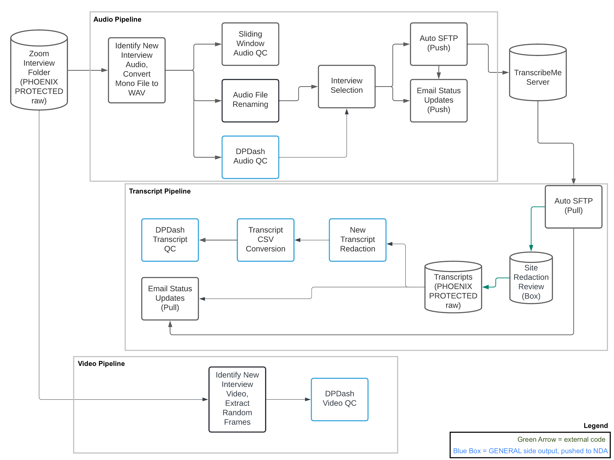

# Interview AV Data Aggregation and Quality Control

Code for data organization and quality control of psychiatric research interview audio and video recordings, written for [the AMPSCZ project](https://www.ampscz.org/) and focusing primarily on recordings saved via Zoom. To facilitate interview recording collection in such a large and diverse collaborative project, the pipeline has a few major functionalities, performed daily across sites and interview types (open and psychs) on the two central data aggregation servers for the project (Pronet and Prescient):

1. Tracking interview recordings submitted so far, and in this process flagging any major upload issues such as missing modalities, incorrect file formats, or missing metadata. As part of this, newly submitted interviews are logged daily, and proceed to the next steps of the pipeline if the upload does not have fatal flaws.
2. Mapping interview date metadata to a study day number based on the days since the subject in question consented - this is done to remove potentially identifiable real date information from any outputs that are considered deidentified, while still maintaining an invertible mapping to the stored raw data.
3. Extracting light weight quality control (QC) metrics from the primary audio and video files of each interview, to monitor for major quality issues in submitted recordings. Poor quality can result from hardware issues or from failure to follow the standard operating procedure (SOP) for how the interviews are supposed to be conducted.
4. Managing data flow to TranscribeMe's server of the mono interview audio recordings that pass basic file accounting and QC checks. This includes managing the routing of recordings in different languages to the correct set of transcribers.
5. Managing data flow from TranscribeMe's server of any returned transcripts. This includes active monitoring of current pending transcripts, and management of the manual site redaction review process that a subset of transcripts must undergo before being considered finalized.
6. Generating redacted copies of finalized transcripts using TranscribeMe's redaction notation (curly braces around PII), and ensuring the redacted versions of the transcripts are in place for transfer to downstream AMPSCZ servers that handle the raw deidentified datatypes meant for use in analysis.
7. Computing QC metrics on the final redacted transcripts, to further inform the quality monitoring process.
8. Utilizing information from the entire pipeline run to communicate updates and new potential issues for each site - by both generating email alerts directly, as well as ensuring all QC metrics are organized and in place to be transferred to downstream AMPSCZ servers that handle the QC monitoring dashboards.
9. Summarizing the file accounting information, warnings, and QC metrics across sites on the server, for central monitoring purposes of each site's progress to date on each interview type. This involves a daily summary email with all information for a select group of recipients and a weekly summary email with QC-related information for a broader group of people involved with the project. For the weekly email, distributional visualizations and a heavily pruned html-formatted stats table are generated from the denser set of QC outputs.

This README provides setup and use information for future projects that might wish to utilize a version of this code, as well as implementation details, troubleshooting tips, and longer term goals to assist not only in potential adaptation of the pipeline but also its continued use in AMPSCZ. Substantial additional information on the project, including reports on outputs of the code from early interview collection, can be found within [my thesis](https://menace.live/thesis). This documentation is up to date as of early May 2023, at which time responsibility for this code is being passed on to others involved in the project. 

- Michaela Ennis

### Table of Contents

1. [Setup](#setup)
2. [Use](#use)
	- [Configuration Files](#config)
	- [Input Data Requirements](#inputs)
	- [Cross-Study Utilities](#weekly)
	- [Example Outputs, Common Issues, and Storage Considerations](#issues)
3. [Audio Processing Details](#audio)
4. [Transcript Processing Details](#transcript)
5. [Video Processing Details](#video)
6. [Final Accounting Details](#accounting)
7. [Security Review](#security)
8. [Next Steps](#todo)
	- [AMPSCZ Logistics](#logistics)
	- [AMPSCZ Code](#code)
	- [Future Code Adaptations](#future)

### Setup 

It is highly recommended that this code is run on a Linux machine, but there are minimal hardware requirements as the pipeline was designed with low compute resources in mind. Given the naturally large file sizes of recorded video interviews however, a decent amount of system storage space is expected (to be detailed). The code requires FFmpeg (tested version 4.0.2) and Python3 (tested version 3.9.6) to be installed, as well as use of standard bash commands, including realpath and dirname. For the email alerting to work, the mailx command must be configured. The python package dependencies can be found in the setup/audio_process.yml file, with the exception of SoundFile and librosa on the audio side and PyFeat on the video side. If Anaconda3 is installed this YML file can be used directly to generate a usable python environment.

	
For the AMPSCZ project, the above dependencies were already installed and the sendmail command configured on the relevant servers by IT. Thus I installed my code with the following steps (once in the directory location intended for software installs):

* git clone https://github.com/dptools/process_offsite_audio.git
* cd process_offsite_audio/setup
* conda env create -f audio_process.yml
* conda activate audio_process
* pip install soundfile
* pip install librosa
* pip install opencv-python
* pip install torch --no-cache-dir
* pip install py-feat==0.3.7
* sudo yum -y install libsndfile
	- This last step was done on Prescient data aggregation server only, to get SoundFile and librosa to work there. It may or may not be necessary to do this then, depending on what libraries are already installed by IT on your machine. 
	- If it is missing, it might require contacting IT to do the libsndfile installation, if you do not have sudo access (which ideally the account officially running daily AV processing should not, to protect raw file integrity).

Note I installed a few PyFeat dependencies (OpenCV and PyTorch) separately before the PyFeat installation, because we are using low resource servers for data aggregation and they were unable to install PyTorch without the --no-cache-dir flag. On a different machine those two steps before the PyFeat install may not be necessary. 

Similarly, version 0.3.7 of PyFeat is the one used across AMPSCZ, and it is known that the latest version is not compatible with the pipeline, because it is no longer possible to specify None for the pose, FAU, and emotion models when initializing a PyFeat detector. On the Pronet data aggregation server there is not enough RAM however to even load those models, and so it is important for the pipeline to be able to load *only* the lightest weight face detection model when running video QC. For other projects this may not be a concern, in which case it would be fine to install the latest version of PyFeat (as of spring 2023), but would require changing the line in the video QC python function that specifies the models to be loaded. However, for an isolated conda environment to be used for the sole purpose of running this pipeline, there would be minimal benefit to upgrading the PyFeat version at present.

As time goes on it will of course be important to be aware of updates to any of the pipeline dependencies, and maintain the repository accordingly. In addition to the direct dependencies, there are also indirect dependencies on assumptions about Zoom recording settings, and for AMPSCZ there are interactions with other tools written for the purposes of digital psychiatry study management as well -- mainly the Lochness and DPDash codebases, which were further adapted specifically for the use of the AMPSCZ project (see dptools project on GitHub that also contains this repo). Lochness is used for pulling the data submitted by sites and enforcing the expected folder structure, but it would be possible to recreate the folder structure manually or with different software if desired. DPDash is used for visually monitoring updates to the dataset via a regularly refreshing web portal, but is not strictly necessary. These are all helpful tools for managing AMPSCZ and would likely be helpful for other future projects too; for the most part, I will assume throughout this section that this pipeline will be integrating with Lochness and DPDash equivalents wherever it is used, and will thus make clear what design decisions are influenced by those tools throughout.  

Finally, besides the code installation, note that for the transcript portion of the pipeline it will be necessary to have a TranscribeMe SFTP account set up with expected transcription settings, including return format of .txt with no headers and UTF-8 encoding. Specifically, AMPSCZ uses the TranscribeMe full verbatim transcription service for its uploaded interviews with turn-level timestamps, which is a manually done human (professional) service. Produced transcripts are HIPAA-compliant with personally identifying information (PII) marked. We use the "AI learning team" of transcribers to ensure a maximal level of care is taken in transcription accuracy. A TranscribeMe rep can assist in matching AMPSCZ's protocol for future projects. For more details on the exact output conventions expected from TranscribeMe, please refer to [the thesis PDF](https://menace.live/thesis). One might also refer to [TranscribeMe's (English) style guide](https://www.dropbox.com/s/lo19xzux3n16pbn/TranscribeMeFullVerbatimStyleGuide.pdf?dl=0).

### Use 

The pipeline will generally be run using the four wrapping bash scripts provided in the top level of the repository, with the path to a settings file as the single argument (shared across branches of the pipeline). The four scripts cover audio preprocessing, transcript preprocessing, video preprocessing, and finally subject-level (i.e. site wide) summarization for monitoring. Each such overarching pipeline branch script will save detailed logging information from each run to a logs subfolder, which is made inside the installation folder of the repository. The audio_process conda environment should be activated prior to launching these scripts. In AMPSCZ, each site is treated by the code as an individual study, and so has its own settings file and will have each part of the pipeline run independently on it. For a template that can be edited into a settings file for a particular site in a project like AMPSCZ (or a particular study on a lab server), see setup/example_config.sh. The available settings in this file will be outlined shortly. 

Each major step in a given branch of the pipeline is initiated using a script in the individual_modules folder, see this folder if specific steps need to be run independently. More details on the separate steps will be provided in subsequent sections. First, basic instructions on running the full pipeline to completion for a given site (specified within config) will be provided though, for each branch separately. Note that in addition to the main pipeline, a few utility scripts are provided for combining info across studies. To see how these fit together, refer to the wrapping scripts found within the repo, currently running on a daily cronjob for each of the two AMPSCZ central servers: amp_scz_launch/production_pronet_all_sites_cron_script.sh and amp_scz_launch/production_prescient_all_sites_cron_script.sh respectively. 

Specifically for AMPSCZ, the repository folder itself can be found at the path /opt/software/process_offsite_audio on the Pronet data aggregation server and at the path /home/cho/soft/process_offsite_audio on the Prescient data aggregation server. 

	
Click here for a visual overview of data flow and the use of different modules through the pipeline.

 

The full audio branch of this pipeline can be run for a particular configuration with the following command:

	bash interview_audio_process.sh example_config.sh

Similarly, the transcript branch of the pipeline can be run using the same settings file with:

	bash interview_transcript_process.sh example_config.sh

While the transcript branch generally relies on the audio branch having completed first, the video branch can be run independently, again using the same settings file with the following command:

	bash interview_video_process.sh example_config.sh

Finally, the site-level summarization branch of the pipeline for additional monitoring (which relies to some extent on outputs from all prior branches) can be run with the following command:

	bash interview_summary_checks.sh example_config.sh

Of course the user should substitute the path to the config file with the settings they actually want to use in the place of "example_config.sh" here.

##### Configuration Files 

	
The settings that can be specified for the pipeline (shown in the setup/example_config.sh file) currently are as follows:

* data_root, which is the root path to the main data structure folder. For a given AMPSCZ server this is the same across sites, and within the Baker Lab this is the same across most studies (but not all, as data from some different collaborations are kept on different briefcases). In our terminology, this would be the path on the server to the PHOENIX folder.
* study, which is the name of the study (e.g. BLS) or site (e.g. PronetLA) on the server. This must match the folder name corresponding to the study/site.
* auto_send_on, which for AMPSCZ is expected to always be "Y". If "N", then QC will be computed for the audio without sending anything to TranscribeMe.
* transcribeme_username, which should be the username used to login to the TranscribeMe SFTP server where data transfer for the project is intended to take place. For AMPSCZ this is one email for Pronet and one email for Prescient. For a lab group this may always be the same username across studies, or it may vary depending on payment allocation details.
* length_cutoff, which is the minimum duration for an individual interview recording to be sent to TranscribeMe, in minutes. For example, one might consider an interview of less than 10 minutes to likely be a fragment or incorrectly conducted and not worth sending for transcription. However for AMPSCZ this is always expected to be 0. 
	- Note that a maximum length per transcript of ~30 minutes is enforced on TranscribeMe's end for the project, as the science committee wants these audios to be transcribed but does not want to spend too much on them. For a similar setup please discuss with TranscribeMe (though I do not necessarily endorse this approach personally). 
* db_cutoff, which is the minimum volume for a mono interview audio recording to be considered acceptable for transcription. In our hands on prior projects we decided on a 40 db cutoff, so this is also what is used for AMPSCZ. To date it has only been triggered once while ~500 interviews have now been successfully transcribed, and inaudible rates in the transcribed interviews have largely been very good. Future projects might consider further tweaking this number, though it may be largely a non-issue for both Zoom audios and handheld EVISTR recordings in the context of transcribability. For lab onsite interview recordings using other audio collection methodologies, we have seen more variance in quality and more frequently unusable audio though.
* auto_send_limit_bool, and if this is "Y", auto_send_limit. For AMPSCZ and for internal projects we have kept this setting to be "N", but it is an option provided for safety with research expenditures, especially if the code is run less frequently or left to run only at the end of a study. When the setting is turned on, auto_send_limit should be an integer specifying the maximum number of total minutes that it is acceptable to upload to TranscribeMe in a given run of the code with these settings. If the sum of audio lengths selected for upload exceeds this value, the files will be left set aside in the respective to_send folders (described more in implementation details below), but will not yet be uploaded to TranscribeMe - so the decision can be sorted out manually instead.
* lab_email_list, a comma-separated string of email addresses for the detailed monitoring updates to go to. This was originally intended to contain site-specific addresses for AMPSCZ, but to date monitoring has been largely centralized, and so the addresses here are similar across configs. All of the daily (as needed) site-specific emails will go to the addresses listed under the current site config. For central monitoring across many sites/studies, I would highly recommend setting up targeted email filters, but if monitoring is well-distributed than the rate of messages should be extremely manageable.
* site_email_list, another comma-separated string of email addresses specifying those that should receive emails when there are outstanding transcripts awaiting manual redaction review for that site (first 5 transcripts from each site and a random 10% thereafter). These are the only emails that actually go to site contacts for AMPSCZ at this time. Obviously this is only relevant if manual redaction review will be a part of your project.
* server_version, which is a label that will be applied to email headers to help email filters differentiate between different projects. For AMPSCZ, we primarily used this to easily distinguish between development testing alerts and alerts from real production data when those servers were running simultaneously for Pronet (and later for Prescient) near the start of data collection ramp up, as central server name (e.g. Pronet) is implicit in site name (e.g. PronetLA). In other large scale projects, this string could be used to make a variety of other designations as needed.
* transcription_language, which is a string (currently in all caps) that specifies the language the site will be using to conduct most of their interviews. The pipeline uses this string in the filename it uploads to TranscribeMe, to assist their process in assigning the correct transcription team to a given upload. When transcripts are pulled back this part of the name is removed, so it is used only in the TranscribeMe upload process and not on actual pipeline outputs (or intermediates). This could theoretically be used to convey other messages to TranscribeMe such as transcription settings, in future adaptation of the code. The information here will also be compiled as part of metadata that goes to the NIH data repository for AMPSCZ.

The configs being actively used (or for some sites prepared to be used) for AMPSCZ can be found in the amp_scz_launch/production_pronet_site_configs and amp_scz_launch/production_prescient_site_configs folders for Pronet and Prescient respectively.

To add new sites to the existing processing for this project, one can simply add another config in the appropriate folder for that central server, working from the existing configs for that server as a template (and referring to the above where additional reference is needed). One would then just need to make sure that there are not issues with folder permissions when Lochness initializes the structure for that site. Obviously for setting up a brand new process, one would aim to replicate the current setup for Pronet and Prescient as far as settings files and cron job go, after following the installation instructions in the preceding section to get the code and its dependencies onto the new central server. In the case of a new central server, it would obviously be necessary to change some further settings within each new config -- such as the TranscribeMe username, which would require creating a separate SFTP account with TranscribeMe reps first.

	
On that note, an additional component built into the config .sh file is the management of the password for the specified TranscribeMe SFTP account, which I will describe how to set up for new servers/projects here:

In order for the code to run automatically on a cronjob, the password for the TranscribeMe SFTP server needs to be stored somewhere on the source server. By default, this is assumed to be in a file named .passwords.sh directly under the repo folder where the code is being run. The .gitignore included with the code will ensure that the .passwords.sh file is never pushed back to the central repository (as well as any logs generated by the code more broadly). On both Pronet and Prescient data aggregation servers, this passwords file has 700 permissions and is owned by the account that is set to run the pipeline code. For more on privacy/security, see the security review section below. 

If one will use an identical setup to the AMPSCZ central Lochness servers, then it is straightforward to just create the process_offsite_audio/.passwords.sh file directly and then paste in the following two lines:

transcribeme_password="password"
export transcribeme_password

Where of course "password" is replaced with the TranscribeMe SFTP account password corresponding to that server's account. Note that TranscribeMe will also periodically require this password to be updated, so for all projects (including both accounts for AMPSCZ) it will be necessary to occasionally update the password contained in the .passwords.sh file directly on the applicable server. 

If one wants to store the password file elsewhere or needs to use different password files for different studies/sites operating out of the same server (because different TranscribeMe SFTP accounts are being used), the path to the passwords file can be specified using the passwords_path variable found at the bottom of each config file (like example_config.sh). The passwords file itself needs to be an *sh* file type with content matching the above to work out of the box, but there is no other restriction on the naming/folder placement (as long as the running account can access) when its path is appropriately specified within the corresponding config.sh settings file.

##### Input Data Requirements 

For the AMPSCZ project, we expect two different types of interviews (open and psychs), which are both handled by the full pipeline and will both be included in the same email alerts, but are processed independently by each module with outputs saved separately. These expectations are built into the wrapping pipeline scripts, and so at present the names of these two interview types are somewhat hard-coded. 

The code expects to work within a PHOENIX data structure matching the conventions described in the AMPSCZ standard operating procedure (SOP). The pulling of data submitted by sites into this folder structure is handled by Lochness in our case, though it is still possible for sites to violate some interview naming conventions within this framework, as Lochness does not enforce e.g. the presence of a date in the folder name as a requirement for upload to the central server. Regardless, I will detail exactly what inputs are expected by the code from the perspective of already being on the central server in this section. 

Note in addition to the upcoming expectations for interview naming conventions, the code also requires a metadata file directly within the site/study level folder contained on the GENERAL side, and will only process a particular participant ID if that ID appears as a row in said metadata file with a corresponding valid consent date (per Lochness guidelines, though again this could be replicated independently). If there are issues encountered with the basic study setup appropriate error messages will be logged.

Note the pipeline only ever reads from raw datatypes. All pipeline outputs are saved/modified as processed datatypes. The deidentified data that make it under the GENERAL side of processed will subsequently be pushed by Lochness to the *predict* server for downstream analyses and eventual upload to the NIH data repository.  

	
More specifically, the raw audio and video data available for an interview are expected to meet the following criteria on the central server, first described for Zoom interviews and then for EVISTR (psychs-only) recordings:

For Zoom interviews, each session should have all files under a single folder, which I will call here Zoom_folder_name. It should contain the interview components like so, matching automatic naming conventions currently used by Zoom:

* Single video should then be found directly under Zoom_folder_name/video\*.mp4, where \* represents a wildcard that could match any additional text in the filename string.
* Single collapsed all-speakers (mono) audio file should be directly under Zoom_folder_name/audio\*.m4a
* Diarized speaker-specific audios should be under a subfolder, Zoom_folder_name/Audio Record/\*.m4a
	- Be aware there is a chance these filenames contain participant names

We require Zoom_folder_name to begin with "YYYY-MM-DD hh.mm.ss ". Again, this is default Zoom formatting, and the code utilizes the date and time info provided, so it is important to not change it. Anything can come after the date/time metadata (but note the second space at the end to split out the time). 

For psychs interviews only, the SOP also allows for interview sessions to be recorded by a single device, so single audio files (each representing one session) of the following form are also allowed directly as a raw interview submission. Like the Zoom interviews, we also require timestamp metadata in the top level name. The SOP requirement here is "YYYYMMDDhhmmss.WAV".

In this case, the code is currently strict in requiring exactly this naming format with nothing appended. Note the capitalization of WAV, which is also required at this time (per the default of the approved recording device).

The transcript side of the pipeline primarily relies on outputs from the audio side. It also expects a box_transfer/transcripts folder on the top level of the PHOENIX structure's PROTECTED side, to facilitate transferring completed transcripts to the corresponding sites for correctness review. In finalizing the transcripts that are subsequently returned by sites, it looks for the interviews/transcripts datatype on the PROTECTED side of raw, and it expects these transcripts to have the same name as those originally returned by the pipeline via TranscribeMe. 

On that note, the code also expects TranscribeMe to return transcripts with a name identical to the uploaded audio filename, just with the extension switched to .txt. So it is possible, though not an issue we've encountered much, that TranscribeMe could cause a stall in processing by violating naming conventions.

##### Cross-Study Utilities 

In cases where multiple different studies - or for projects like AMPSCZ, sites - are being tracked simultaneously, it will often be desirable to have some monitoring at the server-wide level, summarizing progress per study/site in one place. For the present codebase, I have included supplemental utility scripts for AMPSCZ (but easily adaptable to other contexts) to generate such Pronet and Prescient wide summaries. They continue to run automatically for this project and have had minimal issues since implementation, in addition to helping us catch a number of quality issues as a complement to the views in DPDash.

These utility scripts create the weekly histograms, tables, and combined QC + accounting CSVs that are sent out by the code. They also integrate with DPDash tools to facilitate central monitoring. Note while these functionalities are particularly helpful for monitoring quality of successfully processed interviews (and noticing site-specific trends), data upload issues and other more fundamental SOP violations may not be reflected in these summaries, which focus on those interviews with QC information available. Please continue to refer to core pipeline features on the site-specific level for tracking of logistical problems with interviews.

	
The primary resources attached to the weekly monitoring emails are as follows:

* A PDF containing histograms of select QC feature distributions across the server, with open and psychs interview types represented separately via a stacked histogram approach.
* A PDF containing histograms of select QC features distributions across the server for open interview only, but with different sites now represented separately.
* An analogous PDF for psychs interview distribution visualization across sites.
* An HTML table containing counts of good, acceptable, and bad quality interviews by site and type. 
* The abridged version of that table focuses only on transcript quality, but there is another table attached with similar counts giving more detailed interview counts across different modalities. 
* A CSV containing information on how many subject IDs for each site have transcripts available for both open interview timepoints (baseline and 2 month follow-up) versus just one or the other (or neither, for any IDs that are known to have some interview upload processed across types).
* The combined QC CSV with key QC metrics from across modalities provided for all interviews processed on the server to date -- this is similar to what is imported in the combined DPDash view.

A concatenated SOP violations list CSV and overall processed accounting CSV (more detailed contents of which will be described subsequently) are then attached to a second weekly monitoring email for those looking into possible upload/file organization mistakes or who are otherwise doing more detailed data evaluation.

In [the thesis](https://menace.live/thesis), I also investigated relationships between some of the QC features in the early AMPSCZ interview dataset. Although scatter plots are not part of automated monitoring updates, the notebooks used to generate them can be found in the amp_scz_launch/preliminary_stats repo folder. By downloading the combined-QC.csv sent by the weekly logging utility, it should be possible to rerun the notebook at any time to get the latest scatter plots, though one may want to tweak some of the visual settings as the number of sites and the number of data points increase over time.

The script coordinating the cross-site monitoring utilities for AMPSCZ can be found at amp_scz_launch/final_all_sites_utility.sh. The arguments it takes are specified within the amp_scz_launch/production_pronet_all_sites_cron_script.sh and amp_scz_launch/production_prescient_all_sites_cron_script.sh scripts that control the running of the entire pipeline for each respective AMPSCZ central server. The final_all_site_utility.sh script organizes the summary CSVs on a daily basis - optionally emailed to a specified list, which is currently just "mennis2@partners.org,philip.wolff@yale.edu". Those CSVs are used on a weekly basis by another script that is called by the top level cron scripts, again with settings specified therein. Histograms and formatted tables are restricted to this weekly update. That script is amp_scz_launch/weekly_logging_utility.sh, which manages the generation and emailing to a broader list of project staff of the weekly figures and tables every Monday. Both the described utility scripts draw on python functions found under the amp_scz_launch/helper_functions repo folder. 

	
Possible updates to the core server-wide monitoring utilities that would be necessary for continued operation in AMPSCZ might include the following:

As far as the automatic daily and weekly summarization scripts though, little should need to be updated by AMPSCZ, and the main update for future projects looking to use the code would be the broader issue of handling cases where the interview types are not specifically "open" and "psychs". The primary change that may need to be made periodically for AMPSCZ will simply be to change the list of addresses receiving emails for each central server. The settings for that, particularly relevant for the more widely dispersed weekly figures, can be found towards the bottom of each of production_pronet_all_sites_cron_script.sh and production_prescient_all_sites_cron_script.sh central bash scripts. There the pii_email_list specifies the addresses to receive combined CSVs with SOP violation and processed accounting logs to date -- CSVs that contain dates and could potentially contain real names in certain violation scenarios, but are important for logistics tracking. Then the deid_email_list specifies the much longer list of addresses to receive the QC figures primarily described here.

For AMPSCZ members making changes to these sorts of settings, please be sure to update the code on the repository for any longer term updates and also ensure that the new code is correctly pulled to the relevant data aggregation servers. A small additional note to be aware of is that the Pronet data aggregation server uses -A flag for mail command attachments currently whereas Prescient uses the more standard -a flag. 

For changes that might need to be made on the DPDash displays of combined QC, note that the utility scripts directly in this repo run daily on the data aggregation servers and only function to inform the email alerting system that is the major component of monitoring implemented directly by this pipeline. Saved combined CSVs and records of sent emails can be found within the pipeline's logging outputs. But because Lochness pushes only outputs stored directly within the GENERAL side of the PHOENIX data aggregation folder structure to *predict*, which is defined very clearly on the level of the individual subject ID (and interview type), combined CSVs are not pushed to predict. The combined CSVs generated for DPDash then are actually created directly on predict. This is done using very similar code to portions of the cross-site utility scripts that were described here, adapted directly from those scripts. However they are run independently by DPACC, and stored in a different repository related to AMPSCZ's DPDash utilities. That repository additionally includes some other utility functions originally written by me to format other summary information for display on DPDash, in particular the code defining CSVs in the needed form for our DPChart views. In sum, for changes that may need to be made to DPDash steps of the interview monitoring workflow, please contact DPACC instead of working directly in my repository.

##### Example Outputs, Common Issues, and Storage Considerations 
This repository primarily focuses on use of the code from the perspective of the data aggregation servers on which it is running. However, within AMPSCZ, the code interfaces with other software infrastructure and ultimately relies on correct behavior from across a variety of sites. As a precaution, a large number of safety measures for catching issues have been built into the pipeline, and have indeed caught an array of problems on the part of the site. While this sort of documentation is not really in scope for the repository README, I provide within [my thesis](https://menace.live/thesis) a comprehensive list of site protocol violations that have been caught by the code, along with examples of how pipeline outputs can help to catch such problems, and how these problems can impact the project not only through missingness, but possible waste of server storage, transcription budget, and so on. Section 2.3.2 provides the bulk of this information, with 2.3.2.1 presenting example pipeline outputs of interest for early AMPSCZ data collection, 2.3.2.2 listing out the many issues we have encountered to date, and 2.3.2.3 characterizing storage space expected for the collection of interview recordings and the subsequent use of this pipeline.

### Audio Processing Details 

	
The major steps of the audio side of the pipeline are as follows, presented alongside their corresponding wrapping bash modules (as subbullets), modules which should be reviewed in greater detail if one plans to run only pieces of the pipeline:

 
1. Identify new interview audio files in raw by checking against existing QC outputs and interview protocol upload expectations, first for open interviews and then for psychs interviews. This involves converting any newly found top level interview audio files to WAV format (if not already), thus saving WAV versions (a copy if EVISTR WAV format on raw) of all new mono audio files within the corresponding folder on the processed side of PROTECTED.
	* These tasks are handled by the run_new_audio_conversion.sh module, which relies on ffmpeg but does not utilize python.
2. Run quality control functions on the new audio files, which at the start of this step are found with default date/time naming under a temporary folder on processed. A sliding window audio QC is run to create a single output for each file that will also allow for easy checking of whether a raw interview has already been processed. Then the new audio files are renamed to match SOP convention for processed datatypes, including removing date/time info and instead naming in terms of the study day that the interview occurred (where the corresponding participant's consent date is defined as day 1). Finally, interview-level QC is calculated on the renamed files, to produce final shareable QC outputs that can assist with downstream steps.
	* These tasks are handled by the run_audio_qc.sh module, which calls the following python functions to initiate each of the 3 described steps for a given participant ID and interview type:
		1. sliding_audio_qc_func.py (run per file by the module instead of per participant/type)
		2. interview_audio_rename.py
		3. interview_audio_qc.py
	* Details on the exact outputs produced by these steps will be provided subsequently.
3. Check for sufficient volume levels to determine which mono interview audio files should be uploaded to TranscribeMe (40 db for AMPSCZ). This will also enforce other per interview upload requirements if they are specified in the current settings file (e.g. minimum individual interview duration), and it will ensure that uploaded files indeed met the basic SOP metadata requirements as well, denoting reason for rejection for any file that is not approved to be sent. For psychs interview type specifically, it will prevent the sending of any interview that is not the first from its day number for that subject ID (so that sites cannot get around the hard cap on transcription duration for individual interview sessions that TranscribeMe implements for this project).
	* These tasks are handled by the run_audio_selection.sh module, which calls the interview_audio_send_prep.py python script for each subject ID/interview type to actually identify and set aside approved files for the next part of the audio pipeline branch.
4. Upload all approved new audio files to TranscribeMe SFTP server (with temporarily appended site-based language marker to the end of the processed file name convention, to assist TranscribeMe in assigning transcribers). Any audio that fails to upload will be kept in the folder with approved audios so that a future run of the code can hopefully successfully upload it. All properly uploaded audio (which in practice is basically all selected audio) are moved to a different subfolder to be used by other parts of the pipeline in tracking pending transcriptions.
	* These tasks are handled by the run_transcription_push.sh module, which primarily uses the interview_transcribeme_sftp_push.py script (called for each subject ID and interview type with files awaiting upload) to handle the SFTP push. More details on the upload implementation can be found in the security review section below.
	* This step can be turned off via settings file, where it is also possible to add a "stop loss" of a certain max duration sum for uploads from the current run (the latter done where applicable by the same module calling the overall interview_audio_length_check.py python script). However AMPSCZ does not restrict interview uploads to TranscribeMe in any such way.
5. Compile and then send an email listing all files that were newly processed, indicating which were successfully uploaded to TranscribeMe and otherwise documenting possible quality issues. Note that this step requires "build up" of content from all previous steps, and should really only be run in the context of full usage of the audio branch of the pipeline at present. Additionally, it only runs in cases where upload to TranscribeMe is turned on (though one could hack around this by setting the mentioned "stop loss" maximum total sending limit to 0 sum minutes).
	* These tasks are completed by the run_email_writer.sh module, which calls the study-level interview_audio_email_write.py python helper to add further information to the drafted email body.
6. Update the file accounting log to specify all of the raw audio files that were newly recognized and (hopefully) processed on the current run, taking note not only of the present date but also metadata that could be (incorrectly) changed in the future, such as the consent date that is listed for each relevant subject ID at the time of file processing. Further, this step maps the identified day and session numbers to the raw real date/time, it denotes whether a file was rejected for upload to TranscribeMe or not, and it collects extended information on the contents of the corresponding raw folder -- such as the number of speaker-specific audio files present in any Zoom interview folder.
	* These tasks are completed by the run_final_audio_accounting.sh module, which calls the python script interview_audio_process_account.py on each subject ID and interview type. Note this step, unlike the daily email alerting, occurs even if automatic TranscribeMe upload is turned off. 
	* The primary use case for the outputs of this step within the broader pipeline will be downstream site-wide monitoring/alerting on possible QC and SOP concerns, processes to be described soon as part of the details on the final branch of the pipeline. 

For implementation details, one should refer to the python functions (found under individual_modules/functions_called within the repo folder) that are used by the wrapping bash modules (found directly under individual_modules), as described in the above list. 

Aside from the renamed and converted audio files that can be used directly for future processing by AMPSCZ code, the primary immediate outputs of this part of the pipeline are the audio QC features. Of course the audio branch also uploads audio to TranscribeMe and does other file accounting to facilitate downstream processes, but those steps (and their subsequent outputs) will be focused on in the upcoming sections on other branches of the pipeline. As such, I will close this section with more detailed information on the audio QC outputs produced by my code.

	
The paths of key outputs on the data aggregation server are as follows:

 
The primary audio QC output is the interview-level quality summary stats for each mono interview audio, mapped to the final date-removed filenames produced by the renaming step, with one row per interview session. The interview_audio_qc function creates (and subsequently updates) one such QC CSV per subject ID and interview type, saved on the GENERAL side of processed. I will first explain the filenaming conventions and use cases for these CSVs, and then will go into the specific QC metrics contained within.

Under GENERAL, the main interview-level CSV for a given participant and interview type can be found at "siteFull"/processed/"subject"/interviews/"type"/"site2Digit"-"subject"-interviewMonoAudioQC_"type"-day"start"to"end".csv. To illustrate, an example such path would be PronetOR/processed/OR03988/interviews/open/OR-OR03988-interviewMonoAudioQC_open-day78to78.csv. Of course as new interviews are processed, the day numbers will expand to reflect the latest range: so the example file mentioned might one day have suffix "day78to138.csv" for instance, if OR03988 has a second open interview conducted 60 days after their initial open interview. 

The pipeline will automatically only retain the latest audio QC summary CSV for a given ID and interview type, ensuring that prior records are properly concatenated to the current CSV before deleting CSVs with outdated day numbers in the filename. It is important that outside processes never delete these QC CSVs however, as the persistence of prior QC records is vital to the operation of the pipeline over the course of a project. For example, these CSVs are loaded by the audio selection step of the code, to determine which audios successfully passed the metadata needed for renaming as well as the simple quality control threshold(s).

Because the mentioned CSVs are stored on the GENERAL side of processed, they will additionally be pulled by Lochness to the fully centralized *predict* server, where DPDash can be set up to visually monitor progress updates through the web, and where data will get staged for later sharing with the NIH data repository. These QC results that are shared there are indeed used as part of the high level interview metadata mapped to redacted interview transcripts that are planned to be released (prepped by the transcript branch of the pipeline to be described below). 

It is also on predict where further merge operations and QC summary stat filtering/binning occur, in order to construct the CSVs that are imported into DPDash to create the central server-wide views shown in [my thesis](https://menace.live/thesis) -- including both the combined longitudinal heatmap of all sessions and the per subject counting stats used in the open interview bar charts. Because Lochness does not handle renaming of files (for safety against data deletion), predict will by default store all of the outdated DPDash CSVs with different day numbers in filenames. Future projects using DPDash might consider reevaluating the CSV naming convention that it requires, to avoid this problem with constantly changing filenames; first and last available day numbers are directly contained in the CSV anyway. 

Recall that my code does not handle any processing or maintenance on predict, and is not influenced by any operations on predict (though these could hinder the usage of integrated tools like DPDash with my outputs).

	
Critically, the columns found in each interviewMonoAudioQC file (with values mapped per interview) are as follows:

 
* Metadata required by DPDash or to otherwise assist in downstream merges. 
	- Note that only a necessary subset of DPDash columns are actually filled with values however.
* Length of audio (in minutes).
* Overall volume (in dB).
* Standard deviation of amplitude (though as mean amplitude of audio files is generally 0, this is often a direct transformation from the log scaled dB).
* Mean of spectral flatness (computed by librosa).

The specific column names used for these features are:

	["reftime","day","timeofday","weekday","study","patient","interview_number","length_minutes","overall_db","amplitude_stdev","mean_flatness"]

With reftime always containing np.nan as the value but present as the first column for DPDash compatibility. The rest of the columns are appropriately filled out based on available interview information. Recall that this QC output focuses on mono interview audio, which will be the top level audio file containing all speakers in the case of Zoom.

It is worth highlighting that an interview might be rejected by the audio selection based on the content of the CSV (too low volume for the corresponding row, multiple psychs interview sessions uploaded on the same day from one ID, etc.), reasons that will be logged in the email alerts. However a file also may be rejected because the queried filename could not be found within this CSV, or because the corresponding CSV was not found in the first place. The former will log as a metadata issue and the latter as a permissions issue, as these are possible reasons for a detected interview audio that passed initial SOP screening to later fail. In practice, especially for long interviews on Pronet, the same error messages might also trigger though because the audio QC function crashed before the information about that interview could be saved. More on troubleshooting this issue (among others) can be found within the future directions section below.

	
As mentioned, the audio QC processing includes a sliding window QC operation as well, which is performed on the identified new (WAV-converted) mono audio files as a first step under the PROTECTED side of processed before they are renamed according to typical output conventions. The details of these CSVs are as follows:

 
One such sliding window QC CSV is saved for each detected mono interview audio file, and the CSV filename matches the date and time given for the corresponding interview in raw -- which is then used for filtering out previously processed interview audios on subsequent pipeline runs. 

These sliding window QC outputs are not currently used for any other purposes besides processing documentation (and thus should not be deleted - they take up minimal storage space anyway). The filename map txt files giving a very direct command line accessible link between raw interview name and processed interview renaming are similarly important to retain through the duration of a project. Because they stay on the PROTECTED side of processed, these outputs within AMPSCZ are never shared with *predict* either, and in some sense are thus only intermediates. Still, they could assist in the future for quickly identifying certain finer timescale issues, like psychs interview audios that contain a notable break for a time in the middle of the recording. It is particularly plausible that such outputs might be used to facilitate certain steps of the upcoming feature extraction pipeline, which is to be written for obtaining shareable acoustic measures of possible clinical relevance from interview audio files.

Indeed, a given sliding window output CSV will contain decibel level and mean flatness values as the primary metric columns, with each row corresponding to a particular slice of the interview. By default (and therefore for all AMPSCZ interviews), the sliding window QC computes metrics in 3 second increments with no overlap between these bins. However the default could easily be changed for a future project by supplying additional arguments when the sliding QC python helper is called by the wrapping audio QC module.

### Transcript Processing Details 

The transcript processing branch of the pipeline of course generally relies on successful completion of the audio processing branch of the pipeline, and subsequent return of TranscribeMe transcriptions as specified. Most of the steps thus rely on assumptions about TranscribeMe, though one might still utilize the latter modules in a case where obtained transcripts are analogous but the project uses a different upload/download process, or conversely the earliest modules in a case where TranscribeMe is being used but the specified settings for the project are very different. For AMPSCZ, all branches of the pipeline are obviously being run daily for each site, and if no new transcripts have been returned by TranscribeMe for a particular site, the transcript branch of the pipeline will simply flag any pending transcriptions in the monitoring steps (if relevant) and gracefully exit.

	
Nevertheless, I will now provide a parallel list of major code steps and their corresponding wrapping bash modules for the transcript branch of the pipeline, as I did for audio above:

1. Check the TranscribeMe server for any pending transcriptions, and pull back all those that have been newly completed. Of the newly pulled transcripts, direct them either towards the site manual review process or towards the next steps of the processing pipeline (bypassing manual review), as per the procedure defined in the SOP. This step additionally takes note of the current status of each such transcript as it works through them, to compile an up to date monitoring email (if there is any actively relevant information to share for the site's transcriptions status). 
	* These tasks are handled by the run_transcription_pull.sh module, which primarily uses the interview_transcribeme_sftp_pull.py script (called for each subject ID and interview type with files awaiting transcripts) to handle the SFTP pull. More details on the download implementation can be found in the security review section below.
	* The run_transcription_pull wrapper itself handles manual review assignment, first determining whether the site has had at least 5 interview transcriptions sent for manual review yet, and then if not assigning all new transcripts to manual review, otherwise assigning each new transcript to redaction review with 10% probability while allowing the rest to skip manual site checking. 
	* To keep track of transcripts that are still awaiting TranscribeMe transcription, the corresponding audio WAV files are kept in a pending_audio subfolder within each participant and interview type's PROTECTED side processed folder by the overall pipeline. These files should obviously not be deleted then, but as transcripts are successfully pulled back to the data aggregation server from TranscribeMe's SFTP server, this first step of the transcript branch of the pipeline will move them to a different (completed_audio) subfolder. The contents of those completed_audio subfolders can safely be deleted at any time if storage concerns arise.  
2. Identify any transcripts that were sent for manual site redaction review and have been newly returned, to copy them to the appropriate location on the data aggregation server for file organization and downstream pipeline steps. Also identify those transcripts (if any) that are still awaiting manual review for a given site, to put together a list for a daily email alert to the site contacts (as needed).
	* The former task is handled by the run_transcription_review_update.sh module, and the latter by the run_transcription_review_alerts.sh module -- both of which are simple bash scripts written for these AMPSCZ-specific accounting issues.
3. Create redacted versions of any newly finalized transcripts, whether just returned by TranscribeMe and bypassing manual redaction review or just returned from the site review.
	* This task is handled by the run_transcript_redaction.sh module, primarily through calling the redact_transcripts_func.py python helper on each new transcript identified to have a redacted copy generated.
	* Recall that for the AMPSCZ project, TranscribeMe returns transcripts with redacted markings surrounding all PII/PHI words, but not obfuscating the words themselves (a good idea to consider for future projects). To mark words here we use {curly braces} as our convention, because they are not otherwise used in TranscribeMe's notation. Therefore TranscribeMe is the one performing the redacting, but this step is needed in the code to create shareable fully redacted versions by replacing all marked words with REDACTED. 
4. Convert any newly redacted transcript text files to CSV format, with each row a line in the transcript (here mapping to individual turns in the interview) and columns corresponding to TranscribeMe speaker ID, TranscribeMe turn start timestamp, and the verbatim text itself. This step will also confirm that the returned txt is correctly UTF-8 encoded and clean up excess white-space characters.
	* These tasks are handled by the run_transcript_csv_conversion.sh module, a pure bash script written to parse transcript text files formatted according to TranscribeMe's convention(s).
5. Compute interview-level transcript QC stats across the redacted transcript CSVs, to produce shareable QC outputs for transcription monitoring on the level of the subject ID and interview type -- analogous to the final audio QC CSVs described in the preceding section.
	* These tasks are handled by the run_transcript_qc.sh module, through calling the interview_transcript_qc.py python function for each participant ID and interview type with transcripts available. Details on the exact outputs produced by this QC function will be provided subsequently.
6. Send the daily monitoring/alerting email(s) when applicable. The main monitoring email, to go to central monitors at present, will list all the transcripts that were successfully pulled from TranscribeMe for the current site, and those still awaiting transcription, as well as the transcripts newly returned from manual redaction review. The alerting email listing any transcripts actively awaiting manual redaction review goes directly to site contacts by contrast. 
	* Both of these emails were compiled as part of earlier pipeline steps described, and are only sent near the end of the transcript pipeline process because major warnings/errors that arise in later conversion and QC steps may be appended, to assure they are not missed.
	* The sending of these emails (when created due to relevant updates being available) to the email addresses specified in the corresponding config occurs directly in the top level transcript pipeline branch wrapper (interview_transcript_process.sh), rather than occurring in a separated module. 
7. Update the file accounting log with information on current status of all of the newly recognized/moved/processed transcripts, including additional metadata like whether the transcript was marked for manual redaction review, the date that each major step in the transcript flow was completed (thus far), and specific transcript txt encoding info. This is an analogous step to the final accounting step on the audio branch of the pipeline, with similar downstream uses. 
	* These tasks are completed by the run_final_transcript_accounting.sh module, which calls the python script interview_transcript_process_account.py on each subject ID and interview type. 

	
Note that to transfer files back to sites for the described manual review, separate code was written - by the Pronet IT team for push from their data aggregation server to Box and by DPACC for push from the Prescient data aggregation server to Mediaflux. My pipeline fits within that dataflow as follows:

When my code designates a transcript for manual redaction review, it will put a copy of it into the PROTECTED/box_transfer/transcripts folder on the respective data aggregation server's main PHOENIX data structure. This folder is called box_transfer on both servers for simplicity. The supplemental transfer scripts (both found outside my repository) will then use information in the transcript file names along with Box/Mediaflux API tools to upload the transcripts for review to the corresponding site's Box (or Mediaflux) transcript review folder, moving them on the server from box_transfer/transcripts to box_transfer/completed to denote the transfer was successful. As my code checks this "completed" subfolder to see how many have been transferred so far for a given site, it is important that the transcripts stay there. 

When my code designates a transcript for manual redaction review, it will also move the version of the transcript returned directly by TranscribeMe into a "prescreening" subfolder that is contained within the folder where both the raw transcripts that bypassed site review and the returned versions of manually reviewed transcripts are kept on the top level. This way we can always compare versions of transcripts before and after manual site review, in which sites should add curly braces around any words they feel were missed PII by TranscribeMe before returning them back to the data aggregation server.

To return successfully reviewed transcripts, the sites should simply move finished transcript text files from the "For review" subfolder they have in their transcript review Box/Mediaflux folder, to the corresponding spot under the "Approved" subfolder within the transcript review Box/Mediaflux -- without changing the file path name under these subfolders when doing the move between the two. For more specific instructions on performing this transfer (and the manual review itself), please see the AMPSCZ project SOP. 

Lochness pulls any transcripts that have been correctly moved by sites to within "Approved" in this way, uploading them to the PROTECTED side of raw on the data aggregation server. Then my code copies newly returned transcripts into the corresponding places on the PROTECTED side of processed to maintain a complete set of final transcript txts with PII visible, handling the rest of the transcript processing steps from there (as were described above). Note that the only transcripts under raw will be those that underwent manual review and were subsequently returned, those that bypassed manual review will stay only under processed folders.

The primary outputs of this branch of the pipeline include the transcripts at various stages of processing, as well as the final transcript-derived QC measures. I will now provide more information about the contents of these outputs and their locations on the data aggregation servers.

	
The paths of key outputs from the steps of transcript processing are as follows:

We receive full verbatim transcriptions from TranscribeMe, with turn-level timestamps of second resolution and speaker identification included. As mentioned above, any PII in the transcription is marked by curly braces. Cost per minute varies by language. Saved transcripts can be found both with PII visible on the PROTECTED side of processed, and with marked PII fully redacted on the GENERAL side of processed. The former transcripts cannot be shared with the wider group but when needed can be further processed by those with access to the data aggregation server data structure. The latter transcripts are automatically pushed to *predict* by Lochness, and will eventually be staged for regular transfers to the NIH data repository. The redacted GENERAL side transcripts are also converted to CSV format for easier processing, as described above, which facilitates the transcript QC process as well.

The final PII-visible transcript txts can be found on the main PHOENIX data structure of each central aggregation server at paths of the form PROTECTED/"siteID"/processed/"subject"/interviews/"type"/transcripts/"siteID"\_"subject"\_interviewAudioTranscript\_"type"\_day"dayNumber"\_session"sessionNumber".txt, where day number and session number are formatted as 4 and 3 digit integers respectively, defined based on the study day and interview number determined by the renaming function in the audio branch of the pipeline. Recall that there are many reasons (like split interview folders or backdated uploads) that could cause the automatically-determined session numbers to diverge from the true session number per the protocol for each interview type. This is discussed at greater length within [the thesis PDF](https://menace.live/thesis) (in section 2.3.2.2), but ultimately it does not affect the workings of the interview dataflow/QC pipeline, and can easily be taken into account in downstream interpretation. 

The final redacted transcript txts can be found analogously at paths of the form GENERAL/"siteID"/processed/"subject"/interviews/"type"/transcripts/"siteID"\_"subject"\_interviewAudioTranscript\_"type"\_day"dayNumber"\_session"sessionNumber"\_REDACTED.txt. Under each GENERAL side processed transcripts folder, there is also a "csv" subfolder that holds the CSV-converted versions of each redacted transcript text file. In the future, AMPSCZ analysis work taking place on the data aggregation briefcase might include comparing the fully redacted transcripts to their PII-visible counterparts.

Of course, analogous to the audio branch of the pipeline, transcript QC features are stored on the GENERAL side of processed using DPDash naming conventions. Thus for all participants with interview transcript(s) of a particular type available, there will be a CSV containing interview-level transcript QC metrics for those sessions, found on the data aggregation servers at paths of the form GENERAL/"siteFull"/processed/"subject"/interviews/"type"/"site2Digit"-"subject"-interviewRedactedTranscriptQC_"type"-day"start"to"end".csv. The general construction/structure of these QC CSVs is similar to those for audio QC, and they are obviously also pushed by Lochness to predict and subsequently imported for viewing in DPDash. Additionally, they play a critical role in the quality monitoring processes that occur outside of DPDash, including some that utilize the data aggregation server more directly (such as email alerting). 

As an aside, if you are in charge of the TranscribeMe SFTP account you will by default receive a separate email alert from them for every single completed transcript they upload to the SFTP server. You can turn these off (or redirect them to other addresses) by contacting your TranscribeMe rep. Regardless, please note that these emails have no direct relation to the interview pipeline described here, which has its own email alerts. Not every transcript returned by TranscribeMe will end up in manual site review, and there can be up to a one day delay between TranscribeMe returning a transcript and it hitting the data aggregation server, as my code runs on a once daily cron job to check for new transcriptions to pull back from the TranscribeMe SFTP server. From there, there could be an additional delay of up to a day for the external utility script to transfer any transcripts that were selected for manual review to Box/Mediaflux, and for transcripts not selected for manual review there could be an additional delay of up to a day for produced redacted transcripts on the GENERAL side of processed to be copied over to predict. 

Usually gaps between these separated steps will be shorter than a full day, but please wait a reasonable amount of time before raising a potential missingness concern based on TranscribeMe's email alerts. More importantly, please do not raise a concern about missing transcripts based only on what gets transferred to the sites' manual review Box/Mediaflux folders, as the clear majority of transcripts do not get sent for manual review at all and thus never get synced back to Box/Mediaflux. Finally, if you are performing data monitoring for AMPSCZ, please do not contact TranscribeMe directly looking for transcript outputs unless you have first confirmed the missingness is a TranscribeMe issue. Transcripts for this project need to flow through the designed pipeline, for privacy and data integrity reasons, and as far as actual unintended missingness is concerned it is far more likely to be a site mistake or even a code bug -- not things TranscribeMe has any control over. There have of course been a few times where we had to contact TranscribeMe over real issues with the way they returned a file, but these instances have been very rare. If you are not the person responsible for monitoring the operation of this software, you should probably not be the person initiating contact with TranscribeMe about a possible missing transcript.  

	
The specific metrics calculated in the transcript quality control step are as follows:

* Metadata for DPDash formatting and related tracking (analogous to the audio QC step above).
* Number of unique speakers identified by TranscribeMe (labeled in the txt using speaker IDs "S1" to "SN" for N speakers, numbered in the order they first spoke).
	- Note that per the AMPSCZ SOP, S1 should be the primary interviewer and S2 the participant, and open interviews in particular should only have 2 speakers total - though these instructions have likely not been perfectly followed by sites to date.
* For each of the first three speaker IDs (S1-S3), the following counting stats:
	- Total number of conversational turns.
	- Total number of words.
	- Smallest number of words in a turn.
	- Largest number of words in a turn.
* Number of times throughout the transcript a segment of the audio was marked \[inaudible\].
* Number of times throughout the transcript a segment was marked as uncertain (where TrancribeMe places the word/phrase followed by a ? in brackets).
* Number of times throughout the transcript \[crosstalk\] between two speakers was marked.
* Number of words marked by TranscribeMe as {PII} throughout the transcript.
* Total number of commas appearing in the transcript, as well as the total number of dashes appearing in the transcript (both related to TranscribeMe's verbatim notation, so this is a quick check on that).
	- For more on TranscribeMe's verbatim convention and leveraging this in feature extraction steps in order to detect different categories of linguistic disfluency, see [TranscribeMe's (English) style guide](https://www.dropbox.com/s/lo19xzux3n16pbn/TranscribeMeFullVerbatimStyleGuide.pdf?dl=0).
* Timestamp for the start of the final turn, in minutes.
* Shortest gap between the starts of two subsequent turns, in seconds
* Longest gap between the starts of two subsequent turns, in seconds
* The shortest and longest such gaps weighted by the number of words in the intervening sentence.

Thus each column in an interviewRedactedTranscriptQC DPDash CSV is one of these individual metrics, and each row is a particular transcript (corresponding to one interview session). The specific column names used for these features are:

	["reftime","day","timeofday","weekday","study","patient","interview_number","transcript_name","num_subjects","num_turns_S1","num_words_S1","min_words_in_turn_S1","max_words_in_turn_S1","num_turns_S2","num_words_S2","min_words_in_turn_S2","max_words_in_turn_S2","num_turns_S3","num_words_S3","min_words_in_turn_S3","max_words_in_turn_S3","num_inaudible","num_questionable","num_crosstalk","num_redacted","num_commas","num_dashes","final_timestamp_minutes","min_timestamp_space","max_timestamp_space","min_timestamp_space_per_word","max_timestamp_space_per_word"]

All of these features are imported into DPDash to assist in interview progress monitoring as needed. With results reported in [my thesis](https://menace.live/thesis), a subset of the transcript QC features (in addition to normalized versions e.g. redactions per word) have been studied in more depth in the early AMPSCZ dataset, and where useful have subsequently been more closely monitored as part of regular data quality assurance.

### Video Processing Details 

The final relevant modality for interview recordings is video -- assumed to be obtained from Zoom for the present code, and a required component of the open interview protocol (optional for psychs) in the AMPSCZ project. The video parts of the pipeline do not rely on outputs from the audio/transcript branches to be available, so for basic data monitoring and quality assurance purposes it is possible to run only the video branch, if desired by a future project. Obviously for each AMPSCZ site all branches are run daily, and in the cron job we use the video modality comes third after the audio and transcript code has been run for that site. Given the format of Zoom meetings, the main goal of video QC here is to determine how many faces are detectable throughout the interview, along with some other basic facts about detected faces like their estimated size in the frame. Of course the pipeline also handles basic metadata compilation for file renaming and monitoring purposes on the video branch too. 

	
For more clarity, I will now provide a parallel list of major code steps and their corresponding wrapping bash modules in the video branch of the pipeline, as I did for audio and transcripts above:

1. Identify new video files that have been correctly uploaded to raw within a Zoom interview folder, additionally initializing an email body for the video update daily site message if there are indeed any new videos available for the current site. From each new video, extract 1 frame for every 4 minutes of recording. The extracted frames of course go into the PROTECTED side of processed, contained within a subfolder that is named using the date and time of the interview extracted from the Zoom title. The presence of such extracted frames is used in subsequent runs to determine whether a video has been analyzed yet or not.
	* These tasks are handled by the run_new_video_extract.sh module, which relies on ffmpeg but does not utilize python.
	* Note frames are extracted periodically so that face detection can be run whilst keeping the pipeline feasible to use on the lightweight data aggregation servers and quick to complete processing of even longer recordings.
2. Run PyFeat's basic face detection model on each newly extracted frame, saving details about any detected faces on the frame level, as well as using those results to compile per interview summary stats about face detection. This step also utilizes site and interview metadata to map each raw video name to an appropriate processed file name based on our conventions, ultimately creating/updating a DPDash-formatted video QC CSV for each subject ID and interview type with new recordings. That info is used in adding details about successfully processed (or not) video recordings to the daily video site update email as well.
	* These tasks are handled by the run_video_qc.sh module, through calling the interview_video_qc.py python function for each participant ID and interview type with newly extracted video frames. Details on the exact outputs produced by this QC function will be provided subsequently.
3. If a daily video monitoring email has been constructed due to new video uploads being detected, send out that finalized email. This email will provide a list of all new video recordings processed for QC, in terms of their final renaming for processed outputs. It will also include any error messages that may have arisen that prevented QC from running on other newly detected video files. 
	* The email body was compiled (when relevant) as part of earlier pipeline steps described, and is then sent near the end of the top level pipeline branch wrapper (interview_video_process.sh), analogous to the transcript email alerts step. 
4. Update the file accounting log with metadata information related to the newly detected videos, very similarly to the final accounting steps at the ends of the audio and transcript branches of the pipeline. 
	* This task is completed by the run_final_video_accounting.sh module, which calls the python script interview_video_process_account.py on each subject ID and interview type. 

Note that if the daily video update message sends for a site but includes no video names and no specific error messages, it means that a new video was detected but the code failed prior to reaching the video QC step - thus indicating a likely error with ffmpeg's frame extraction command on one of the site's uploaded interview recordings. For more interpreting possible edge case errors within the existing monitoring infrastructure (for all parts of the pipeline), please see the troubleshooting information in the future directions section below.

The primary output of the video branch of the pipeline is again the DPDash CSVs for quality assurance monitoring, although the interview video renaming maps, as well as the extracted frame images and their corresponding PyFeat outputs, have possible downstream uses too. The details of these outputs follow, first file naming conventions and then additional content information where applicable. 

	
The paths of key outputs from the steps of raw video processing are as follows:

When a new, correctly formatted, video has been uploaded by Lochness to raw within a (likely new) Zoom interview folder, the first step of the pipeline will create a corresponding subfolder for storing extracted frames from that interview on the PROTECTED side of processed. These folders can be found on the main PHOENIX data structure of each central aggregation server at paths of the form PROTECTED/"siteID"/processed/"subject"/interviews/"type"/video_frames/"date"+"time", where "date" and "time" are extracted from the Zoom folder name based on expected conventions. Each extracted frame from the interview is saved as a JPG under such a folder and named based on its timestamp within the interview; the sampled frames are taken from pre-determined recording timestamps that occur literally every 4 minutes, starting from the 1st second of the video (to avoid the very first frame), and then proceeding with timestamp 00:04:00, 00:08:00, and so on. These extracted frames are expected to be kept on the PROTECTED side of processed for the duration of the study, for both accounting purposes and for quick spot checking videos as needed.

As part of video QC, more detailed PyFeat information is stored for each frame, to reference in possible expanded QC if needed in the future. The individual frame CSVs are named according to their corresponding frame JPGs, under a subfolder with the extracted frames i.e. video_frames/"date"+"time"/PyFeatOutputs. Also as part of the video QC there is a raw to processed file name link stored, analogous to the audio file name maps previously described. This mapping can be found at video_frames/"date"+"time"/"date"+"time".txt, and it is especially important for ongoing accounting that it is not deleted for any previously processed interview videos. The file name of the txt itself, when taken along with folder names contained in the rest of the file path structure, is directly linkable to a specific raw interview folder upload. The content of the txt is what that raw video should be renamed to in a processed setting, based on SOP conventions.

Of course all of the video outputs contained within a video_frames subfolder are on the PROTECTED side of the data aggregation server storage structure, and are thus only accessible to a limited number of individuals working on AMPSCZ interview recording collection. The primary output type that is pushed along to *predict* is the DPDash CSV with per interview video QC stats. Like audio and transcript QC, those metrics can now be visualized using the DPDash web interface, and they are additionally included in compiled form as part of the weekly summary updates with broader reach (reported on extensively in [the thesis PDF](https://menace.live/thesis), particularly 2.3.2.1). Again, there is one such DPDash CSV created by the video branch of the pipeline for each subject ID and interview type with at least one video recording available on PHOENIX. Each of these CSVs contains one row per detected interview session, and can be found on the data aggregation servers at paths of the form GENERAL/"siteFull"/processed/"subject"/interviews/"type"/"site2Digit"-"subject"-interviewVideoQC_"type"-day"start"to"end".csv.

	
The interview QC metric columns for the video datatype include:

* Metadata for DPDash formatting and related tracking (analogous to the audio and transcript QC steps above).
* Number of frames extracted, and thus used for computing the QC summary stats (should equal the floor of interview minutes divided by 4).
* Minimum number of faces detected across the extracted frames from the interview.
* Maximum number of faces detected across the extracted frames from the interview.
* Mean number of faces detected across the extracted frames from the interview.
* Minimum confidence score across all faces that were detected from across all frames.
* Maximum confidence score across all faces that were detected from across all frames.
* Mean confidence score across all faces that were detected from across all frames.
* Minimum area across all faces that were detected from across all frames.
	- Area for a particular face was computed by multiplying the height and width variables returned by the PyFeat face detection model, describing the face box associated with the detected face.
* Maximum area across all faces that were detected from across all frames.
* Mean area across all faces that were detected from across all frames.

The specific column names used for these features are:

	["reftime","day","timeofday","weekday","study","patient","interview_number","number_extracted_frames","minimum_faces_detected_in_frame","maximum_faces_detected_in_frame","mean_faces_detected_in_frame","minimum_face_confidence_score","maximum_face_confidence_score","mean_face_confidence_score","minimum_face_area","maximum_face_area","mean_face_area"]

	
As mentioned, we also have the CSVs (one per extracted frame) saved in associated PyFeatOutputs subfolders on the PROTECTED side. Those CSVs contain one row per detected face, with the following additional metrics provided as columns:

* Face ID (assigned by PyFeat).
* Face location X coordinate in frame.
* Face location Y coordinate in frame.
* Face box's rectangle width.
* Face box's rectangle height.
* Face's detection confidence score.

Recall that it is not possible to load the standard face pose or action unit detection models on the data aggregation servers (particularly for Pronet) at this time, and it would generally be incompatible with the lightweight philosophy of this pipeline. Therefore any QC code that might use information about e.g. FAUs would need to be separately written, and we focused only on basic detection here. 

### Final Accounting Details 

The final major branch of the pipeline, which also runs on a per-site (or per-study) basis using the config file system described, runs a set of tools added onto the codebase for more detailed file accounting and monitoring.  While parts of the individual modules within this file accounting branch may be useful to run independently on a different project, much of this work relies on existing pipeline outputs from the other three branches -- primarily the outputs of the final accounting step within each of those branches, along with the DPDash QC CSVs for each modality.

The main goal in adding this branch to the pipeline was to call additional attention to SOP violations and clear cut quality red flags, as well as to create some more streamlined progress updates for each site that could assist in higher level monitoring than the detailed emails sent by the other three branches. As part of that, this step also improves the DPDash views available by creating QC CSVs that are combined across modalities for each subject/interview type, with a filtered down set of key columns.

	
Like with the other branches, I will now provide a list of major code steps and their corresponding wrapping bash modules for the additional monitoring components of the pipeline:

1. Identify file formatting and organizational issues that would prevent anything newly uploaded to raw from being processed by the pipeline at all, so that monitoring can easily notice such violations.
	* This task is handled by the run_raw_folder_check.sh module, through calling the raw_interview_sop_check.py python function on each relevant subject ID and interview type. Obviously it relies on assumptions about folder structure and file naming being used for the AMPSCZ interview data collection protocol, which has already been described at length.
	* Many of the types of site mistakes that have prevented processing and were caught by this step in early AMPSCZ monitoring have been identified within [my thesis](https://menace.live/thesis), in 2.3.2.2 as mentioned above. The exact info tracked by this module will be detailed subsequently. 
2. Using the SOP CSV from step 1 and the respective processed accounting CSVs created in the final step of each of the audio, transcript, and video branches of the pipeline, isolate all interview session records that have a newly detected upload issue or have some new processing update. If there are any processing updates, initialize (or add to) a summary stats update email with a header containing a list of subject IDs and interview types that have some processing updates from the current code run. Then for each specific interview record with updates, look up its QC metrics in the corresponding DPDash CSVs for each modality, checking for a few specified major QC red flags as well as some possible metadata inconsistencies (from both QC and accounting CSVs). If any warnings were triggered in that process, or if new basic upload SOP violations were detected, set up (or add to) a warning email alert to be sent today for this site. Ultimately, this step identifies a number of important warnings to be notified about, saving/updating a CSV for each subject ID and interview type where relevant with an account of all warnings detected to date. Also saves a combined version of the processed accounting CSV containing merged info from all 3 modalities (or whichever modalities are available) for each session. 
	* These tasks are handled by the run_processed_accounting_check.sh module, through calling the interview_warnings_detection.py python function for each subject and interview type with any available interview outputs under processed (including just a raw SOP violation log). A more specific list of the warnings that are compiled by this step can be found subsequently.
3. If a summary stats email was initialized for this site as part of step 2, it means that there are new QC metrics for at least one modality of one interview for the site. In that case, the pipeline will compute new site-wide and per-subject summary stats for the current site, with select metrics from the former also being added into the summary stats update email to be sent. Regardless (to account for backlogged updates in a timely manner because it is an important output being pushed to *predict*), all subject IDs and interview types with DPDash QC CSVs available will then have a new modality-merged QC CSV saved containing the latest information. 
	* The wrapping script for this pipeline branch (interview_summary_checks.sh) checks for a new summary stats email body, and if one has been created it will use the run_qc_site_stats.sh module to handle all of these tasks. Otherwise, it will use the run_qc_combine_only.sh module to handle only the task of modality merging QC CSVs.
	* Both run_qc_site_stats and run_qc_combine_only call the interview_qc_combine.py python function on all subjects/interview types with QC available. This is the only major functionality in the run_qc_combine_only module.
	* The run_qc_site_stats module then also calls the interview_qc_statistics.py python script, first for all open interviews across the present site and then for all psychs interviews across the present site. The details of the outputs produced by this module will also be further detailed below.
4. If a summary stats update and/or new issues warning email alert was generated, send them to the site-specific email update addresses specified in the corresponding config. Email sending is again performed directly in the wrapping script for this pipeline branch. Here it is the last step of the pipeline for a given site (when applicable).

Note that while the code is in progress, the described email bodies (when relevant) are drafted directly within the top level of the repository installation folder. After any finalized emails are successfully sent (or if the sending fails due to any issue with the mail command or server connectivity), the corresponding txt files will have a unique Unix timestamp appended to their name and will be moved into the logs folder of the repository for record-keeping purposes. These are of course also part of what will be excluded from any git pushes via the .gitignore. A similar process occurs for email alerts in all branches of the main pipeline.  

A major result of this branch of the pipeline is the more salient daily site email updates produced, particularly the alerts that will highlight new warnings that arise (to be elaborated on), which has been a key part of my monitoring workflow to date - especially for catching violations that prevent an interview upload from appearing in downstream QC records at all. Another major result is the creation of additional CSVs with new curated file accounting and quality control metrics, many of which are later used in server-wide (i.e. cross-study/site) summaries created by the utility scripts written for further AMPSCZ monitoring. Those utilities were introduced in more detail above. Here I will elaborate on the specifics of both the emails and CSVs created by the site-specific monitoring branch of the main pipeline in the above mentioned steps, in order of operations.

	
For the SOP violations step, we have the following relevant outputs:

The first step, utilizing raw_interview_sop_check, creates (or updates) a CSV ending with RawInterviewSOPAccountingTable.csv on the PROTECTED side of processed for each subject ID and interview type, i.e. directly within the folders of the form PROTECTED/"siteID"/processed/"subject"/interviews/"type"/. This CSV contains one row for each problematic file or folder found under the raw interview uploads for that subject ID and interview. Note that only raw paths corresponding to an SOP violation are included in the list, and it focuses only on those SOP violations that completely stall processing of one or more modalities focused on by this interview pipeline (i.e. mono audio and/or video). 

Thus the major issues caught here are:

* An interview upload is a standalone file but it is not named according to EVISTR convention.
* An interview upload is a folder but it is not named according to Zoom recording convention. 
* An interview upload is a correctly named folder but it does not contain a top level M4A file with the expected mono audio naming convention for Zoom, or alternatively it contains more than one such file. 
* An interview upload is a correctly named folder but it does not contain a top level MP4 with the expected video file naming convention for Zoom, or alternatively it contains more than one such file. 

It is possible for a given upload to commit more than one of these violations, but because the various columns contained in the RawInterviewSOPAccountingTable will describe all such issues, there will still only be one row for that upload in the CSV. The columns of the CSV are as follows:

	["raw_name", "folder_bool", "valid_folder_name_bool", "num_audio_m4a", "num_video_mp4", "num_top_level_files", "date_detected"]

Conversely, note that if the files from a Zoom folder are uploaded loosely (outside of their folder), there will be one row in this CSV for each such loose file. When the warnings email is constructed by the next step, it will list the raw name of each record newly added (i.e. detected today) to any RawInterviewSOPAccountingTable from across the given site, where applicable. All such issues are labeled as an "SOP Violation" in that warnings email.

	
Newly detected SOP violations are utilized in the second step, which compiles a variety of warnings from processed accounting/QC too, as follows:

The other types of issues that will be included in the warnings email put together by the interview_warnings_detection function of the second step are:

* "Audio Rejected by QC"
* "Audio Failed SFTP Upload"
* "Missing Expected Speaker Specific Audios"
* "Transcript Encoding Not UTF-8"
* "English Transcript Encoding Not ASCII"
* "Video Day Inconsistent with Audio Day"
* "Video Number Inconsistent with Audio Number"
* "Consent Date Changed with New Files"
* "Session and Day Numbers Inconsistent"
* "Session Number Repeated"
* "Interview Under 4 Minutes"
* "No Faces Detected"
* "No Redactions Detected"

The first 10 problem types listed are derived from the processed file accounting CSV outputs, while the last 3 come from checking QC outputs. This list is of course not exhaustive, particularly when it comes to monitoring of quality metrics; other tools like DPDash and weekly histograms should also be used as part of the quality review workflow.  

Recall that the above issues are only reported here when detected in interviews that were found to have had some update on the current pipeline run. If multiple problems are detected in such an interview though, each will be independently logged -- in the email alert by listing the study day and code-labeled session number corresponding to each problem on a new line. The warnings generation step additionally creates (or updates) a CSV ending with "InterviewProcessWarningsTable.csv" on the PROTECTED side of processed for each subject ID and interview type i.e. under the same location as the RawInterviewSOPAccountingTable CSVs.

The InterviewProcessWarningsTable contains one row per detected processed accounting/QC warning from a run of this pipeline branch, with the following columns:

	["day", "interview_number", "interview_date", "interview_time", "warning_text", "warning_date"]

As such, the CSV can be revisited at any time for a complete record of previously issued warnings for a given subject ID and interview type. 

In the same processed folder, the code also saves a CSV merging the full set of file accounting information that has been compiled to date by other pipeline branches, under a file name ending with InterviewAllModalityProcessAccountingTable.csv. Additionally, the interview_qc_combine function saves an analogous CSV that represents the merging of all DPDash QC CSVs produced from across modalities for each subject ID and interview type, under a file name ending with combinedQCRecords.csv. However the combined QC metrics can be saved on the GENERAL side instead, so it may be pushed by Lochness to *predict*. That CSV is therefore found under GENERAL/"siteID"/processed/"subject"/interviews/"type"/ instead.

	
The third step focuses on QC summary statistics, as follows:

The final major step, utilizing interview_qc_statistics when new processing updates have occurred, creates (or updates) a CSV ending with InterviewSummaryStatsLog.csv on the GENERAL side of processed for each subject ID and interview type. This CSV has 2 new rows added each time it is updated, one for subject-specific summary stats and one for site-wide summary stats, both specific to the interview type and each with a column denoting the current computation date (and obviously a column indicating whether it is a subject summary or a study i.e. site-wide summary). Besides other basic metadata columns, the main columns of this CSV are summary stats over each QC metric available from across the interview modalities. The four summary stats calculated for every QC feature are the mean, standard deviation, minimum, and maximum of the feature to date. 

While each InterviewSummaryStatsLog CSV covers summary stats for all QC features included by the pipeline, a select few on the site-wide level for each interview type (open and psychs here) are included in the daily summary stats update email, when there is new information to be conveyed. In that summary update email, the mean (+/- the standard deviation) are reported for open and then for psychs for the following features:

* "Interview Length in Minutes"
* "Mono Audio Decibels"
* "Audio Spectral Flatness"
* "Video Faces Detected per Frame" (mean per video)
* "Face Detection Confidence" (mean per video)
* "Transcript Number of Speakers"
* "Speaker 1 Word Count"
* "Speaker 2 Word Count"
* "Number of Inaudible Words"
* "Number of Redacted Words"

Note that each InterviewSummaryStatsLog CSV will get pushed to *predict* by Lochness as a GENERAL side output. Concatenated versions of these CSVs (filtered to be on subject and site levels separately) are also attached to a daily server-wide email sent by the AMPSCZ utility scripts described above.

The reason that site-wide stats are stored in every single one of these individual CSVs on the data aggregation server is because there is no good way to store data that is summarized on anything above the subject level with the PHOENIX data structure. Combined versions of CSVs on the site or server level that are computed for email alerts or other logging thus get stored within the repo installation folder on each server, in the logs subfolder. These outputs are of course protected from being pushed back to the central repository via the .gitignore defined in the repo. But still do take care of permissions on the installation folder, to ensure that summary info cannot be seen by anyone who should not have access to the server's interview data on even a summary level. In particular, real dates can be found via these files.

	
Finally, I summarize here how this information has been used in AMPSCZ monitoring:

Ultimately, the participant-wide accounting branch of the pipeline has been important for the monitoring workflow of AMPSCZ. While the specific warning alerts are not exhaustive and sometimes can be triggered by different mistakes than they intend to encode, they have succeeded in capturing a great number of issues across sites, and continue to be checked regularly to find new SOP violations. For more on the specific warnings messages of greatest relevance and the likely root causes behind different types of warnings, please see the troubleshooting information within the future directions section below. 

The summary stat updates on the site-level sent by this branch of the pipeline can be of use as well, though for reviewing other possible QC issues I largely use the stats from cross-site server-wide information emailed out by the mentioned utility scripts. Primarily I review the weekly histograms and tables described at length in [my thesis](https://menace.live/thesis) to detect possible new problems, but I also often refer to the combined QC CSVs from daily email updates if more specific stats need to be investigated for a given interview. 

### Security Review 

	
For security review, we interact with the TranscribeMe SFTP server using the following process:

Audio files are pushed to TranscribeMe using the following process. We connect to the TranscribeMe server via SFTP. The pySFTP python package, a wrapper around the Paramiko package specific for SFTP is used to automate this process. The host is sftp.transcribeme.com. The standard port 22 is used. The username is provided as a setting to the code, but will generally be one account for all sites on the Pronet side and one account for all sites on the Prescient side, with set up of this facilitated by TranscribeMe. These accounts are created only to be used with this code and will serve no other purpose.

The account password is input using a temporary environment variable. It was previously prompted for using read -s upon each run of the code, but for the purposes of automatic scheduled jobs, the password may now be stored in a hidden file with restricted permissions on a secure portion of our machine instead with permissions fully limited to only the account meant to run the interview pipeline. Presently this has been approved to be stored directly in the folder where the code is installed, but if needed it could instead be stored directly on the PROTECTED side of PHOENIX. In that case, there would be a further layer of guarantee, as anyone who could access the password file necessarily must also have access to the raw files themselves, so use of the TranscribeMe password would provide no additional benefit.

Interfacing with TranscribeMe is done using the same SFTP protocol as described in the audio section. Note that once the transcript side of the pipeline has detected a returned transcript on this SFTP server, the corresponding uploaded audio is deleted by our code on TranscribeMe's end using the same SFTP package. TranscribeMe also automatically deletes files on their server (including the transcripts this code moves to "archive" subfolders) after a certain amount of time has passed. TranscribeMe's server maintenance practices have also been reviewed and approved by Partners Healthcare.

The code itself (in the state presented here) was approved by both Pronet and Prescient central servers for safe installation and use on AMPSCZ data, and it is of course fully available for open source review as the need arises. The other privacy/security considerations relevant to AMPSCZ interview processing relate to other steps of the data collection and analysis process, which I will now touch on briefly as they pertain to possible future changes for this data management/QC pipeline. 

If additional details are needed, please reach out. We can also put you in touch with the appropriate person at TranscribeMe to document security precautions on their end.

	
Another facet of the project relevant to privacy/data security is the use of Zoom for interview recording, which has largely worked out well but has caused regulatory issues at a handful of sites. More on that is discussed here:

The use of HIPPA-compliant institutional Zoom accounts for recording AMPSCZ interviews (as detailed in the SOP instructions and reviewed in the supplemental section S2 of [my thesis](https://menace.live/thesis)) has been IRB approved for all US-based sites and most foreign sites in this project. 

Zoom was originally chosen as the remote interview recording platform because of its ability to save speaker-specific audio files, something absent from other major options (e.g. Microsoft Teams, Cisco WebEx). Of course, it is also desirable for sites across a collaborative study to agree on the recording platform. Fortunately, an acceptable secure protocol for using Zoom has largely been established across sites, and thus the pipeline was designed around Zoom for offsite (and onsite open) interviews. Practically speaking, the current implementation does not carry major risk of privacy violations and is considered suitably secure by institutions across the country (and world).

There are still a handful of sites that have not been permitted to use Zoom for recording participant interviews though, some of whom in fact may not be allowed to contribute video of participants at all. These restrictions are primarily a result of legal differences in some European countries, and for this project it is mostly German sites that are impacted. As an edge case, early work on the AMPSCZ interview pipeline did not prioritize accommodating these sites, but it will be necessary in the future to do so. 

Microsoft Teams was one proposed alternative, but not all affected sites could agree on this. Cisco WebEx was the only platform that all such sites were able to get approved by their IRBs. It is therefore recommended that preprocess/quality control code add in handling of Cisco WebEx as another supported platform, for both these AMPSCZ sites and possible future projects that may encounter similar issues. It is worth reiterating though that Zoom should be consistently used for all interviews wherever possible, and WebEx should only be a fallback. 

When adding support for WebEx to the pipeline, it will be important not only to include the expected WebEx file naming conventions and formats in the new audio identification code, but also to update all relevant downstream renaming/accounting steps to ensure that Cisco naming is now considered an acceptable session type rather than an SOP violation. Whoever works on this should walk through all steps of the data flow and monitoring (along with a sample Cisco interview input) to double check that any part of the code potentially impacted by the addition of a new interview platform (or specific differences in output between WebEx and Zoom e.g. lack of diarized audios) are properly updated. Once implemented, the initial stages of monitoring should be extra careful for these interviews as well.

	
Finally, we have some ideals for permissions that ought to be granted on the data aggregation servers for future projects, as well as information on permissions-related bugs that have impacted AMPSCZ and may require continued attention:

For both Pronet and Prescient production data aggregation servers, my account has sudo access. As far as privacy of interview data is concerned this is not an issue, because I was part of a very small group that was granted access to all recordings across sites, in order to implement and test my pipeline. It has also turned out to be extremely helpful in troubleshooting various issues without relying on a slow back and forth with server IT groups. 

However, for data safety reasons (e.g. avoiding accidental deletion), this setup is not ideal for the longer term project, and is something that could maybe be changed when the pipeline is transferred to a different account upon my graduation. Though the code as implemented is careful to not delete anything from raw and it is unlikely a bug could cause the modification of anything under raw, there is no reason why it should be even capable of making any changes to raw side folders. On the Prescient aggregation server, the code is run on cron from my account without the use of sudo currently, so it runs less risk in that respect. 

For Pronet data flow though, the code is now run on cron from a root account. This has the benefit of avoiding some permissions issues that have primarily impacted Prescient project status, but the long term project goal should involve use of specialized processing accounts with tailored permissions. A major roadblock there is gaps in Lochness functionality, something that will come up again in the next section on suggested future code updates. Unfortunately, there has been an under-supply of software engineering time for AMPSCZ infrastructure in general, and this extends to a long wish list for Lochness updates too.

Some specific examples of permissions issues that have arisen when using my account to run the pipeline without sudo access, and that therefore required manual intervention to solve, include:

* Under the GENERAL side of processed for a given subject ID, that ID did not have an "interviews" subfolder, which my account could not create due to lacking write permissions for GENERAL/"siteID"/processed/"subjectID" -- which is in itself reasonable, but Lochness then needs to setup all of the expected datatype folders.
	- Note that this is particularly likely to occur for the interview datatype, because there will never be raw interview-related files under GENERAL. But that does not mean that it does not need a processed folder under GENERAL for the datatype! In fact it definitely does here, as this is how we separate out the shareable products of the interview pipeline.  
	- The same issue could theoretically apply to the PROTECTED side of processed as well, though it appears less common in practice.
* Along the same lines, the "subjectID" folder for a particular subject with interviews under the PROTECTED side of raw does not always exist on the GENERAL side of processed, and sometimes there will not even be a processed subfolder for that ID on the PROTECTED side. My code will try to create such "subjectID" folders, but again my account without sudo often does not (and really should not) have the needed permissions to create folders directly under "processed".
* It has sometimes also happened at the beginning of a site's enrollment that a "processed" folder itself did not even exist yet for that site, seen at times under PROTECTED and at times under GENERAL sides. This is despite a raw interview folder being available under PROTECTED. Of course, the solution to this should be improved folder creation processes within Lochness -- and in this case my pipeline will not try to create the missing folders but will instead just exit the process for that site, logging an appropriate error message. 
* On the other end of the folder hierarchy, it is necessary that on both GENERAL and PROTECTED sides there are open and psychs (matching the interview types) subfolders under "siteID"/processed/"subjectID"/interviews. It should be possible for the interview code running account to write outputs under these type-specific folders. My pipeline will create them if they do not already exist, and has not encountered many permissions issues at this level; but one might also consider building the interview type folders into the Lochness-generated structure instead.
* While my account being able to read raw interview folder contents has not really been a problem, there has been one recurring permissions issue with access to the raw data pulled onto the aggregation server by Lochness, particularly on the Prescient one. This has been the ability to change directories into a particular existing PROTECTED/"siteID"/raw/"subjectID"/interviews/"type" folder. It appears to happen when Lochness assigns S permissions to the group's executable bit on one or more of the folders making up that folder path. It has occurred on a number of newer subjects' folders created by Lochness, and so this is an ongoing issue to watch out for (and in the meantime manually fix with sudo-enabled account as needed).

Ideally the outlined issues would one day be addressed by more robust folder structure setup functionality built into Lochness, so that processing code could focus on generating processed outputs and not core folder structure. This would in turn enable tighter permissions control on different AMPSCZ infrastructure accounts (though the unique lock on raw audio/video to not leave the aggregation server makes it largely irrelevant for other modalities in this project).  

As far as outputs generated by the account running my code, it is important that any on the GENERAL side of processed are accessible by the main account that runs the Lochness pushes to *predict*. The final output updates to group assignment (pronet/prescient respectively for AMPSCZ) and file permissions (770 used here) are lines in the cron job script that runs daily (one for Pronet and one for Prescient). There is no clear reason that this would need to be changed any time soon, though it may still be worth hashing out the exact permissions that are needed for each input/intermediate/output once a final account for running the data flow and QC code has been decided on. Such decisions may additionally be dependent on the plan for central monitoring responsibilities going forward, particularly with regards to permissions on the pipeline products kept on the PROTECTED side of processed (which of course do not go to predict). 

### Next Steps 
Here I will focus on immediate next steps for this repository and the associated dataflow/QC considerations for interviews collected by the AMPSCZ project, finally wrapping up with some tips about adapting this codebase to other similar projects in the future. A broader set of future directions is described in [my thesis](https://menace.live/thesis), including both future steps for the interview datatype and the likely development of a pipeline for processing audio journals recorded by AMPSCZ participants (e.g. see Appendix F). That document additionally includes details on the overall AMPSCZ project goals, interview conduct instructions, and other pertinent background.

##### AMPSCZ Logistics 
For the existing protocols, it is an ongoing issue to ensure that sites are aware of and following all the expectations. 

	
Many questions still remain about code monitoring and communication with various relevant parties that have still not been fully resolved. The main TODOs there are:

* Make decisions about email usage
	- Does content of any of the emails need to be further updated?
	- Who should receive which emails? 
	- How often should emails go out?
	- Any PII concerns with the emails to address?
* Make decisions about code monitoring
	- What account is going to run the code?
	- Ensure file permissions generated by Lochness are compatible, particularly for the processed folders under both PROTECTED and GENERAL
	- What should file permissions be of various code outputs?
	- Who will handle it when changes need to be made on the server? Could involve changes to code, changes to files in processed folders, or changes to files in raw folders
	- Who will be checking the QC outputs on DPDash?
* Set protocol for communication with sites
	- What happens when sites have mistakes with file naming/organization conventions?
	- What happens when sites are missing data or don't complete a necessary manual review?
	- What happens when sites upload poor quality data?
	- Who will be in charge of all of this?
* Set protocol for communication with TranscribeMe
	- What happens when TranscribeMe does not upload a transcript we are expecting for an extended period?
	- What happens when a transcript has enough issues that it needs to be redone?
	- What happens when there is a minor issue in a transcript (outside of the already defined site redaction review)?
	- Will we be providing TranscribeMe with continual feedback?
	- Who will be in charge of all of this?
	- What if an issue arises that requires a speaker of a non-English language?
* Will these communication protocols need to differ between the Pronet and Prescient networks?

Making such decisions will also help with finalizing a TODO list for desired changes to this codebase for the project, something I will now discuss at greater length.

##### AMPSCZ Code 

	
Potential issues and future code improvements to be aware of for management of the AMPSCZ project (along with tips on monitoring existing email alerts and other troubleshooting tools) include:

* May need to add sites to the configs available on the existing servers (e.g. Santiago at Prescient) or possibly eventually set up a third central server. The process for setting up the current sites on the current servers is documented in this section above and should be referenced in this process. 
	- Note that when sites that are already set up with config files newly begin their interview collection process, it is still necessary to confirm that the correct top level folders exist and that permissions are okay, as the code may not start working for that site automatically otherwise.
	- Even for existing sites on Prescient, there may be a recurring issue with S permissions on folders created by Lochness preventing the pipeline from running on some newly enrolled subjects.
* It is necessary to periodically clean up incorrect site uploads on the raw side of PHOENIX manually, once the site has removed or fixed the offending files in Box/Mediaflux. For site mistakes that silently propagate through the pipeline's outputs (e.g. an interview uploaded under the wrong type), fixes need to occur manually on the processed end at this time, ensuring that all relevant intermediates are correctly updated on both the GENERAL and PROTECTED sides of PHOENIX. This includes not just moving or renaming outputs that map to the specific interview, but also editing all affected CSVs and other accounting materials. 
	- A number of early issues that have been documented have not yet been manually fixed in this way, and new ones continue to be periodically detected by the existing monitoring tools. Ideally updates to the code would introduce quality of life tools for semi-automation of such fixes to previous pipeline outputs, though it is of course important that running this sort of tool is done with caution so as to not introduce new mistakes. On the raw side, manual intervention will remain necessary, as automated deletion of raw interviews is highly discouraged. 
	- A number of site mistakes that can cause issues with processed intermediates (or can cause processing to be skipped over entirely) are listed as part of the common problems provided in [my thesis](https://menace.live/thesis) (section 2.3.2.2). 
	- Note it is also not currently possible to explicitly and automatically detect when a prior interview upload issue was fixed. In the general case, this is a challenging problem that is unlikely to be fully automated. But there are certainly quality of life improvements that could be made to the code and the way it interfaces with the monitoring process, to work towards addressing this. 
* A major problem with the code currently that should be dealt with in the near term (particularly after psychs transcriptions settings updates are done to limit the number transcribed) is to deal with periodic crashing issues that cause some interviews to not receive audio QC and thus not be sent to TranscribeMe. The problem seems to be generally caused by interviews that are extremely long, and so it is in part a problem with server reasons, and also has only really impacted psychs interviews. Still, it is important that the code be updated to directly handle such long interviews differently. Furthermore, it is possible for crashing to occur for other reasons, though much less frequent, and there is currently not a good way to make the pipeline go back and redo these rejections without having to manually delete the intermediate files that indicated audio rejection. Additional notes to potentially help troubleshoot the issue follow:
	- Note that for this random crashing, audio and video seems to fail somewhat independently, and audio crashing is notably more common. This also primarily occurs on Pronet, which makes sense because the data aggregation server for Pronet is weaker and Pronet ha more sites submitting problematic and/or absurdly long recordings.
	- For audio, if kernel dies during QC attempt (which seems directly related to very long duration) then the WAV file will be left under rejected and the monitoring email will say there was a file naming issue because it couldn't locate the QC record in the DPDash CSV.
	- For video, the pipeline seems to be failing at ffmpeg frame extraction stage occasionally, which means it keeps getting reattempted every time, but apparently will systematically fail on the affected interviews for months on end. This is why the monitorig emails will say a new video was detected but list none for a handful of sites. I am still not sure what exactly causes this.
	- It is also possible for audio to fail at the ffmpeg conversion stage repeatedly, but since it is never successfully converted this will just be an ongoing silent failure.
	- When audio QC crashes for a non-kernel reason it will catch it and delete the evidence that the file was attempted so that it will try again next time, and it will email about this every day until fixed. This never occurred on Pronet to date, but it had occurred for two Prescient interviews for some reason. It happened for a few straight days before the code crashed in a way that instead caused those two files to be rejected.
	- If the audio QC says the file was rejected for unknown reason (check permissions), then that means that there was some other failure point after the file was converted to WAV besides its ability to be looked up in the DPDash CSV. In the past it often came up when folder permissions were incorrect, hence the added parenthetical, but this is rare to encounter now.
	- For now, the way to trigger a redo of audio processing for audios rejected due to kernel death is to go in and delete a handful of files on the PROTECTED side of processed corresponding to that particular interview: the file name map text file, the sliding window QC CSV, and the audio WAV under the rejected subfolder. Once a solution to the longer interview issue has been implemented, this will need to be done for all the older rejected files. A number of these can be identified by simply looking in the current DPDash CSV for those records with video QC available but not audio QC. 
* As far as storage space is concerned, it is important that processed WAV files are not deleted while they are still in the process of awaiting transcripts. However, they can be deleted if needed once they make it all the way through the pipeline and get placed into the completed subfolder. They are kept as of now to facilitate easier implementation of a feature extraction pipeline, as they are already renamed and converted to the necessary format for OpenSMILE. But because the primary focus of most acoustic feature extraction will be the diarized audios not included at present, it may be worth just clearing the completed WAVs out from time to time. The file name map text files can be used instead to handle mapping new feature extraction outputs to the naming conventions of the pipeline. 
	- On a related note, implementing some QC to run on each of the diarized audios when available would be another valuable addition to the current pipeline. 
* The email alerts sent by the pipeline now could use some cleaning up to better serve the monitoring workflow as it has developed over the course of the project. Particularly once a final manual monitoring procedure is decided upon and responsibilities are more specifically allocated, the emails could be very helpful if directed to the right individuals at the right frequency, but this will require some adjustment. In the interim, some points to be aware of when reviewing the daily monitoring alerts are as follows:  
	- A warning will say that video and audio days don't align when one of the file types is missing or failed processing, so this is rarely an actual metadata issue.
	- More often than not the warning about consent date being changed is not because the consent date was actually changed, but because some bug in the code occurred that disrupted the file accounting. Those records do not have a consent data nor a raw audio file path listed in the standard accounting table, but I am not yet sure what causes this, so it is a pipeline bug that needs to be followed up on. In the meantime, it has also happened that a consent date was changed, so it is necessary to look at the dates in the accounting table when this warning occurs and determine whether it is a real problem or not. When consent dates do change files will become misaligned, and it is not clear how this should be handled systematically, so it is important sites minimize this sort of mistake. 
	- When an SOP violation is listed in the warning email and it is not obvious from the folder/file names supplied, it is currently necessary to look either at the more detailed SOP violation CSV or the raw folder itself to identify the exact problem. It could be that the single folder contained multiple mono audio or video files (split interview) or it could be that the folder was missing one or both of those files (or had them renamed or changed the file format in a way that prevented the pipeline from recognizing it). 
	- In the context of this project, it is generally not important if there is a warning about non-ASCII encoding. However if a warning about non-UTF8 encoding comes up (which it hasn't yet), that will entirely prevent transcript processing and will require manual follow-up. 
	- When the warning email notes that an audio file was rejected, it is necessary to check that day's audio process email update to determine the reason for rejection. It may be a true QC rejection or it could relate to code crashing issues for long recordings mentioned above. 
	- Note that SOP violations in how speaker specific files are named or even in the number of speaker specific files present is not a part of the current email alert system. The total number of speaker specific files is logged in the file accounting CSV if it needs to be checked on, but as long as at least 1 m4a is found under 'Audio Record' there will be no SOP violation logged (and subsequently no warning). The naming of the speaker specific m4a files is not at all taken into account by the present pipeline. As the feature extraction pipeline becomes increasingly necessary to implement, problems with naming of these diarized audios looms large. Thus aside from the infrastructure work required to deal with speaker assignment in the extraction pipeline, there is also room for improvement in what the QC pipeline's monitoring can detect. Review of the speaker specific m4a names could help to catch issues more quickly and ensure longer term data quality by intervening quickly where needed. 
* DPDash does not accommodate sorting of columns within the interface, and the current combined upload is alphabetized by subject ID, only providing chronological order within a subject. This makes DPDash only really helpful for checking on specific files rather than for quickly looking for new issues. It would therefore be a big quality of life monitoring improvement to implement overall chronological ordering for the DPDash views. However this will require pulling in additional information to what is currently output for the GENERAL side, as that removes all external data references. It is also not yet entirely clear to what extent this is allowed, but there are other DPDash views containing real dates at present. 
* For legal reasons, it will be necessary to update the initial stages of the pipeline to accommodate Cisco WebEx for Germany. To do so, we will need to first obtain example inputs for reference, as well as confirm what exactly is expected of the corresponding outputs. There will not be diarized audios, but aside from that and the obvious differences in file name and formatting conventions, it is not yet clear what other differences might need to be dealt with. Along these lines, it may be important to start tracking the source of individual interviews once other services will be supported. 
	- Relatedly, there may be German sites that cannot have video uploaded to Lochness server at all, so any feature extraction on video if it were to occur would need to be set up to run locally. That is a whole separate problem, but in the interim the audio could be uploaded alone. Unclear if there needs to be a careful check for this first though as part of restrictions or if they would just trust their RAs to not put the video part in Mediaflux. 
	- It is also worth noting along these lines that if Zoom has any software updates in the next few years that will change its file recording conventions, the protocol and/or preprocessing code may need to be revisited and adapted accordingly. It will be important to update the code to handle the new case without disrupting the old format, something that already happened to Zoom naming conventions at one time early in the project's development. 
* As more international sites onboard, it will be important as well to be more on the lookout for problems in the code caused by foreign languages that have not yet been tested properly. There will likely need to be updates to the QC code to handle a greater variety in TranscribeMe notation, even if the code doesn't fail in a highly visible way on these other languages. 
	- Still waiting on TranscribeMe to answer about how their notation might change. We know redactions will be the same across languages, but for everything else including marking inaudible words and uncertainty, it is not clear. It is also not clear (especially for languages that do not use an English-like alphabet) whether verbatim notation related to disfluencies (e.g. stutters) would be the same. This is less immediately relevant to the pipeline, but it is the type of consideration that will need to be made as the project expands. 
	- As far as potential Zoom naming convention issues in other countries, the date/time metadata part should probably be fine, but do need to check about 'Audio Record' subfolder, word audio in front of the main file name, and other related raw file convention assumptions. 
	- Note that some sites (thus far Montreal) might use English in some interviews and a foreign language in others. In this case the pipeline labels the upload with the foreign language, and then TranscribeMe redirects to the right transcriber as needed. For downstream file organization and eventual analyses this will remain important to keep in mind.  
* For improving the pipeline's tracking of issues, integration with related information pulled from REDCap/RPMS would be extremely helpful. We do not currently have a good estimate for how many interviews we should actually be expecting for a particular subject at any given time, and we also cannot make entirely accurate assignments to study timepoints (e.g. baseline interview) based on day number alone. This means the monitoring process is likely missing some issues at present, both in how sites are filling out interview metadata information in the research record keeping software and in how certain interviews might be missing for various reasons without our knowledge.
	- At this time, information is available in raw form on Lochness, but it is not at all cleaned. Parts of the process for distilling these records might be a responsibility for other groups within AMPSCZ, but identifying various site issues and ultimately integrating with the interview QC pipeline will require someone that is working directly on interviews to be involved. 

There are also of course a number of action items for the mentioned downstream feature extraction code, some of which integrate directly with this QC pipeline. Similarly, potential future changes to e.g. Lochness will impact what role the current interview pipeline plays. As such, I will now comment in more detail on a handful of topics relating to the future use of my pipeline as it fits within other AMPSCZ processes (whether active or planned). Note that further discussion of work required for Zoom alternatives can be found instead in the security review section above. There are additional discussion topics elaborated on within supplemental chapter S2 of [my thesis](https://menace.live/thesis) as well, within the next steps portion of this code's extended documentation.

	
One major item worth elaborating on here is the processing of REDCap/RPMS interview notes:

Sites log a variety of information about subjects via REDCap (for Pronet) and RPMS (for Prescient) interfaces. Forms relating to the conduct of each interview session are included as part of this battery. However, although some forms are already being used in project monitoring, none of the interview-related information is yet being processed or even systematically referenced by central monitors -- so obviously the information is not yet being integrated with outputs from the interview dataflow/QC pipeline. 

Initial processing of these data likely falls under responsibilities of a different role than mine. Still, once done the cleaned form outputs will need to be integrated with the existing interview AV code, which opens up a number of possible action items for my replacement. Additionally, the lack of this integration is hindering monitoring of interview processing, so if someone with time to properly dedicate to the project were to actually replace me, they could pick up this task and ultimately greatly improve our current monitoring workflow (both of incoming data and of possible software bugs). 

The raw JSON files exported from REDCap and the raw CSV files exported from RPMS are currently pulled to the Pronet and Prescient data aggregation servers respectively, where they are then passed along to the PROTECTED side of raw on *predict* (under the surveys datatype). Processing of these raw form exports should thus likely occur on predict, not the data aggregation servers - in contrast with everything I've done to date. Therefore the merge with available AVL QC data and any subsequent monitoring warnings would also occur on predict, and so this should probably be a separate downstream code repository entirely. Unsurprisingly, the exported data at present are unprocessed with ugly default formatting; the initial undertaking here would be to clean up the AV-related form exports from both services and get this running regularly on predict along with basic integration with the interview pipeline outputs that are available on predict. 

From there, it would be necessary to better understand the information that is found in the interview forms. Not just the questions asked and the possible answer options, but also the trends found in site responses. Given the many mistakes in the interview recording and upload process encountered to date, it is highly likely that there will be mistakes in site responses. The types of mistakes made, how frequently they are made, and by which sites will all need to be identified, as well as how any mistakes relate back to raw interview data (i.e. which form discrepancies are a form-filling mistake versus an interview recording mistake?). If it is anything like the raw interview data, a very wide variety of failure points will be found, and some may need to be protected against in software, while others will require interfacing with site contacts to hopefully improve behavior. As more is learned about the datatype, it may require further changes to how AVL QC is integrated, what sort of monitoring alerts are sent out, and so forth. 

Because of all these challenges, it is important that some legitimate software development time is dedicated to the issue; this is not something that can be thrown together if it is to be used effectively. Of course, the reason it is important that REDCap/RPMS integration for interviews gets implemented is precisely because of the tracking difficulties caused by the many heterogeneous site protocol violations observed with the raw interview data. At present we do not know which interview timepoints sites claim to have conducted, so we can not systematically identify missing sessions -- which can fall through the cracks at many different steps when SOP is not followed, as already emphasized. 

In part as a result of this, I still do not even have an answer about what acceptable timeframes for conducting different interview sessions are. Obviously the 2 month follow-up open interview need not happen 2 months later on the dot, but is 4 months later too long? Is one month later too short? Beyond that, currently I don't know for sure whether an interview submitted 60 days after consent is intended to be the baseline open protocol or is a 2 month follow-up with a missing baseline (digging into a few specific cases, both have been observed). So simply having site-logged timepoint information would be greatly helpful to determining what truly is missing and isolating any presently ignored software bugs as well as protocol (following) issues.

Intended session number and corresponding date (incidentally even a brief manual spot check on Pronet identified some date recording discrepancies that are likely errors on the REDCap end) are not the only useful features found within an interview reporting form though. Another major piece of information is the identity of the interviewer. This could help us identify specific individuals that may be most responsible for their site's common errors, which would allow for more targeted training intervention that would ultimately be more likely to actually change behavior. More importantly for the integrity of the present data, we ought to be verifying interviewer identity is properly recorded so that subject and interviewer can be easily identified from the diarized audios produced by Zoom. 

	
Directly related to form tracking is the updating of our process for deciding on audios to upload to TranscribeMe, which warrants further consideration for the following reasons:

It will hopefully be the case that in the near future some scheme will be adopted to limit the number of psychs interviews sent for transcription (see Appendix F of [my thesis PDF](https://menace.live/thesis) for more on the salient funding-related considerations). Likely AMPSCZ still wants baseline psychs interviews transcribed, and given that we supposedly want this, it seems silly to only get the first 30 minutes of those - they're also particularly common to be very long duration. 

So there are multiple good reasons to limit the number of other psychs interviews that get uploaded for the highest quality professional TranscribeMe service. To do this, one could consider a protocol where a subset of the 8 other clinical timepoints are left out consistently for all subjects, where a consistent fraction of the other timepoints are randomly selected for each subject separately, or where a fraction of subjects are randomly selected to get all of their timepoints transcribed with the rest receiving only baseline. Whatever the organizing committee decides on though, this will need to be implemented within the current code. As an aside, note it would be possible for the pipeline to set aside such "rejected" psychs interviews in a different folder, which would make it very easy for additional uploads to occur in the future if new evidence of scientific uses for these particular transcripts comes to light. To implement a basic version of psychs timepoint filtering in the current framework, please see the interview_audio_send_prep.py file for a note on where such a statement can be added and what other parts of the code would require subsequent update.

To actually implement such a protocol with maximal correctness, it would be necessary to know what timepoint each site is marking a given interview upload as. Thus we are back to the issue of REDCap/RPMS integration. Furthermore, even if such a tool were available as described in an above paragraph, the information compiled on *predict* would not be available by default to the data aggregation server (where the TranscribeMe upload needs to occur from), as information generally flows off of those servers to predict, not the other way around. One could instead try to implement the form-processing code on the data aggregation server, but given the typical protocol for that data flow, it is likely that not all forms are maintained in perpetuity on Pronet/Prescient aggregation servers, as raw data that can make it to predict are intended to have that be their final storage place. Because the forms are not especially large files, this could feasibly be changed, but it would require additional coordination with those at DPACC working on Lochness. Alternatively, they may recommend keeping the form-processing code on predict as I originally proposed, and then adding a utility that gives the data aggregation server access to the combined summary of interview form responses to be regularly generated on predict.

Once these issues with assessing timepoint have been sorted out, other pipeline updates will still need to be made to account for the new case, across steps. Logging of e.g. whether an interview was rejected or not will need to add an entirely separate case (that probably should not be coded as a simple rejection sub-type) to denote psychs interviews that were held back for efficiency/budgetary reasons. That will affect monitoring infrastructure all the way from daily site-directed email alerts up to weekly server-wide summary tables, and thus will require careful checking/testing of many steps of the pipeline (really all of them outside of the earliest audio processing steps and the video branch). Additionally, it will remain pertinent to keep an eye out for a myriad of site mistakes that could affect the transcription decision making process described, especially early on.

	
Perhaps the biggest future undertaking will be interfacing with the feature extraction pipelines to be implemented on the AV processing server:

Beyond the currently active pipeline interactions (or desired interactions), there is also the major feature extraction pipeline project that needs to be developed and will likely need to utilize some of this pipeline's outputs for managing its data flow efficiently. As detailed, it will be important to extract more acoustic and facial feature information to share with the NIH data repository and even facilitate internal AMPSCZ analyses, because statistical status-aware analysis is not to occur on the data aggregation briefcase, and raw audio and video cannot leave that briefcase. 

Of course, the data aggregation servers do not have the compute resources needed to run more intensive feature extraction processes, even the relatively modest functions implemented for the Baker Lab audio diary feature extraction pipeline described in chapter 1 of [my thesis](https://menace.live/thesis). Additionally, it is important that feature extraction would not hog resources from the daily data flow and quality control operations that need to occur on those servers. For these reasons, an AV processing server has been set up for Pronet, with the data aggregation server's main briefcase mounted on it. An analogous system will need to be replicated for Prescient, and though they are reasonably waiting for more concrete functionality on Pronet before investing into this, there could be a number of additional troubleshooting issues or further logistical delays involved in fully rolling out any such feature extraction pipeline because of that. 

Still, here I will focus on the many hurdles piloting interview AV feature extraction systems specifically on Pronet, as this is the major task at hand. Further, I will focus primarily on concrete software-related hurdles, especially those that connect to the use of my pipeline. There are many scientific and bureaucratic hurdles in generating the feature extraction pipeline code too, but despite how shocking the behavior of the supposedly expert speech sampling advisory committee has been in this regard, it is quite frankly not the problem of my direct replacement. 

On the Pronet AV processing server, it is much slower to load the raw interview recording data directly from the mounted briefcase than it would be directly on the data aggregation server; because more people are involved with designing feature extraction code there are greater privacy and data safety concerns when it comes to account permissions as well. For these reasons, the plan for a feature extraction pipeline is to have infrastructure to manage the identification of interviews that still need to be processed (and that are processable e.g. not mislabeled), to maintain a reasonable rate of copying these interviews to the native storage on the processing server where feature extraction accounts can work with them, to ensure that generated outputs are correctly named and transferred back to the appropriate locations on the data aggregation briefcase structure, and to delete the raw files that have completed the intended feature extraction. 

It is therefore obviously useful to draw from existing interview data flow/QC outputs generated by my pipeline. Without doing so, it would be necessary for the feature extraction pipeline to reinvent the wheel with all of the SOP violation tracking and output renaming. It could also lead to some misalignment between outputs generated by the different pipelines, because distinct bugs might be present in each, and more pressingly the various site violations we have observed might be handled differently by each. Thus the best course of action will be to refer directly to the list of interviews that have successfully produced interview QC outputs (per DPDash CSVs) as those that should be copied to the local AV server storage for feature extraction, cross-referencing with the file renaming accounting produced by my pipeline (per file name mappings) to find the correctly corresponding raw paths and subsequently ensure that outputs are named accordingly before their copy back to the data aggregation structure.

On the topic of keeping a reasonable rate of data flow, particularly as the large backlog of interviews to be processed for features gets addressed initially, there will likely be some amount of manual monitoring required, and exact implementation details for marking completed interviews and how to prioritize the not yet transferred ones will require more discussion with the other involved parties. Pronet IT can be very helpful in assisting with some of this data flow code and ensuring that metrics like server resource usage are properly tracked, and will be an important initial resource for this process. The other main reference point will be any of the researchers that are implementing feature extraction functions for AMPSCZ raw audio or video interview recordings. Building the feature extraction pipeline will obviously require composing their various functions, or if they will be the accounts to run their own functions (not the most sustainable long term arrangement) then the data management infrastructure will regardless need to know exactly what outputs to expect for transfer back and for marking the raw file copies for deletion. This remains an ongoing discussion and will probably require some amount of iteration over time. 

Unfortunately, besides interfacing with various different groups and carefully implementing (and then testing) the functionalities needed for utilizing the interview QC/accounting outputs and ultimately handling the downstream data transfers, there are additional complications that will need to be addressed for managing outputs of feature extraction functions for AMPSCZ interviews. Many of the described site protocol violations (and maybe many not yet identified) could pop up in different forms when it comes to impact on feature extraction, and for audio in particular there are new considerations related to the diarized Zoom audio files, files that are largely ignored by the data flow/QC pipeline. 

The largest concern is identification of interviewer versus participant. For transcripts this would be easy when sites follow the protocol, and fortunately because the redacted transcripts can be shared directly with the data repository, there is no issue in later revisiting the automatic assignments, whether adding additional automated considerations to enhance these assignments or doing manual sanity checking where it seems necessary. It is also the case that most language features can be computed in terms of a TranscribeMe speaker ID, and whether a given ID was participant or interviewer (or in the case of psychs interviews some other attendee) can be one of the final steps of a processing pipeline. 

For audio and video however, there is not the same convenience. Data sent to *predict* with a given speaker identification cannot be validated post-hoc in the same way, because no one from that point forward will have access to the corresponding raw audio. The transcription timestamps could perhaps assist (and similarly for determining which face ID is who), but it is a much more difficult problem than it needs to be at that stage. The ideal situation would be for feature extraction code to treat all speaker-specific audios and all face IDs as similarly abstract entities, but then as part of the feature extraction pipeline outputs, a map to the suspected identities would be provided too. That way updated identifications, whether manually adjusted by central monitors or determined by improved automated techniques, could be propagated to old outputs as well as new. This is important for maintaining the highest level of robustness, because it would not be particularly hard to get a mostly accurate identification algorithm working today -- but a huge number of edge cases do complicate complete correctness, and giving purportedly iron clad IDs should require as close to complete correctness as possible, something I suspect the initial version of a feature extraction pipeline will not have. Exactly how it is implemented will require collaboration between the aforementioned groups though. 

Aside from enforcing principled infrastructure decisions, the key role for my replacement in this process would be handling the speaker identification labels directly related to data flow, particularly if they will also end up working closely with the REDCap/RPMS interview forms. This is because the file names of the speaker-specific M4A files found in the 'Audio Record' subfolder of a given Zoom interview recording folder should contain the display name of the corresponding meeting attendee, which if sites follow the protocol should provide a clean indication of who is who. In practice adherence to attendee naming suggestions has been subpar, though as long as interviewers keep consistent display names it remains feasible for code to be written to handle many of the less than ideal cases. 

Even still, there are certain cases that cannot be identified from saved display names alone, and will require reference to forms (if properly filled out) or potentially to other signals based on the actual interview content. The main such case is the onsite open interview, which uses Zoom on two different lab machines. Some interviewers have not bothered to update the display name of the participant, so two known site interviewer names will come up as the two diarized audio file names. On top of that, there are psychs interviews (or sometimes SOP-violating open interviews) where additional meeting attendees will be present, in which case it may not be immediately obvious how to label the primary interviewer versus other interviewers or the participant versus e.g. the participant's parents. Further, and again much more likely to occur for much longer duration psychs protocols, there are instances where an attendee may leave an interview and rejoin or where an entire interview will be split into multiple recordings (which can occur in a variety of ways as previously outlined) -- additional cases that will create more diarized files to handle in the data flow. Fortunately split audios should not generally cause any problem with identification, but they do introduce a number of time alignment issues, and regardless require additional consideration when it comes to data management code. 

For face identification from videos, estimated labels will be more relevant for the feature extraction team to handle, as they will be based more directly on outputs, likely as a first line technique based on face location within the interview frame. Still, those doing quality assurance/data monitoring should very much be aware of and regularly checking on such outputs. Because Zoom will put the gallery view faces in a consistent order from the host's view who is recording the meeting, it should be easy to identify the primary interview from coordinates alone. The problem is pretty well solved then when the only other attendee is the participant, as should be the case for the open interviews (though this is not always followed and interviewers also don't always use gallery view as they are supposed to). However for interviews with more than 2 participants - primarily the psychs interviews, which also have less specific video recording rules overall - it is less clear how to be fully confident in labels assigned automatically based on simple location. Location may even change over the course of an interview as attendees may leave and may or may not come back in the larger interview setting. 

As such, pipeline outputs should be used to monitor for interviews that may cause difficulties to a straightforward face identification algorithm, and invoke manual review of those interviews and corresponding feature extraction outputs where relevant, especially early in the feature extraction launch process. More broadly, this brings up concerns about the lesser quality standards and fewer protocol consistencies across the board with psychs interview recordings. Just one (large) example is that onsite psychs recordings are only mono by default and would require testing automated diarization methods to attempt to extract comparable features to the Zoom interviews' speaker-specific audios. 

While there is no real downside to simply collecting the psychs recordings, and if a plan develops for how to use extracted features then the steps needed to deal with further processing them could certainly prove fruitful. At this moment though, it seems clear to me that psychs feature extraction should be of the lowest priority. I do not think it is a good idea to release poorly validated features, and validating in the case of psychs introduces many challenges given the software engineering resources currently available to the project. The clinical interviews are so much longer than the open ended ones too, and occur at many more timepoints, so they will require much more compute time on top of all of that. Personally I would suggest focusing feature extraction efforts purely on open interviews, first for Pronet and then for Prescient, and return to psychs interviews when there is more bandwidth to handle many of the described complications.  

In any event, the key point is that the existing dataflow/QC pipeline will need to be closely linked to future endeavours to implement feature extraction pipeline(s), something critical to the long term future plan for AMPSCZ speech sampling. Moreover, an eventual feature extraction pipeline could in turn supplement our existing QC monitoring workflows and perhaps suggest expansions to QC metrics that could allow future large scale interview data collection projects to build on the groundwork of AMPSCZ. 

	
Finally, it is worth reiterating information here about safe versus unsafe cleaning of files on the data aggregation server:

Because Lochness does not delete files deleted from source nor rename files renamed on source (instead uploading a copy under the new name), the myriad of site interview SOP violations have lead to a number of incorrect interview recording uploads indefinitely taking up space on the data aggregation server -- this was discussed at length in section 2.3.2.3 of [the thesis PDF](https://menace.live/thesis). Improvements to Lochness's upload filtration process discussed in the preceding paragraph would help to mitigate the issue going forward, but all existing mistake uploads (and any additional ones in the interim) ought to be periodically cleaned out from raw interview folders on the PROTECTED side of PHOENIX manually. 

Interviews are a special case precisely because they cannot go directly to *predict*, and so it is very important that any manual deletion process takes great care, and automated methods for this task should probably be avoided. Similarly, correct raw interview uploads should likely be kept on the respective Pronet and Prescient data aggregation servers for the lifetime of the AMPSCZ project. Perhaps eventually old uploads could be backed up on cheaper (slower to access) storage, but for the foreseeable future it is necessary that access to all raw interview recordings remains easy for the planned feature extraction processes -- the specifics of which continue to be actively changed/updated.

Related to the raw interview data is cleaning of processed interview outputs on the data aggregation servers. There is less of a data cleanliness issue there, but still possible storage optimization considerations. On the flip side, there are some files under processed folders that are very important *not* to delete for the duration of the AMPSCZ project. Thus the main purpose of this section is to emphasize files that should certainly be kept, and reiterate the largest files that could safely be deleted if freeing up space becomes necessary.

On the GENERAL side processed folders, stored interview pipeline outputs are very small and so deletion would provide minimal storage benefit. For most datatypes, everything on the GENERAL side can be passed to predict and then safely deleted from the data aggregation server, because most processing will occur on predict. This is obviously not the case with interview data. The interview-level summary stat tracking CSVs are especially important not to be deleted, as the code expects them to always contain a fully up to date account of the processed interviews thus far. Deleting them at any time could cause unexpected pipeline behaviors, and would almost certainly erase data from DPDash web views downstream. Regenerating them in some cases would be a bit of a pain in the ass too, so this is seriously *not* recommended. While redacted transcripts - the other major interview code output on the GENERAL side - could always be regenerated from their unredacted counterparts, this is not something the pipeline currently expects, and so it could confuse the accounting logs. 

Simply put, there is no reason for any interview outputs on the GENERAL side to ever be deleted, with only possible downsides - so it should not happen. An exception (relative to other modalities) has already been built into Lochness to avoid deleting any processed outputs under the interview folders on the GENERAL side, and this should be kept in place permanently. Future projects that decide to use Lochness and may have similar privacy restrictions specific to AV flow (or decide to use the current interview QC pipeline for any other reason) should be mindful that the default behavior for AMPSCZ Lochness is to delete GENERAL side processed outputs as soon as they are successfully moved to predict, and an exception for the interview data flow to work correctly was later added.

On the PROTECTED side processed folders, Lochness does not delete data automatically, as of course these outputs will never be moved off of the data aggregation server onto predict. As such, any deletion from these processed folders should be carried out with clear intentions and great caution. For interview outputs specifically, it is important that unredacted transcripts do not get deleted, as TranscribeMe will remove them from their server after a time, and so they may be unrecoverable if removed on the respective data aggregation servers. Note that these transcripts are indeed considered a processed output under each interview datatype. 

Transcripts of course do not take up much space anyway, and along the same lines there are some file accounting CSVs and text files (including the per interview audio/video file name map text files and the sliding audio QC CSVs) that would cause serious issues in pipeline functionality if deleted partway through processing of an ongoing study. This set of files additionally includes some subject ID/interview type level CSVs containing row-wise per interview summary info on processing logistics and early pipeline stage SOP violations. None of these processed files should therefore ever be deleted from the data aggregation servers during the course of the AMPSCZ project. The reason they stay on the PROTECTED side to begin with (and so are not even backed up to predict) is that they have the potential to contain PII, such as real dates or file names that may contain real participant names. However the per interview summary info is emailed to a small group of individuals with the appropriate data access level, to assist in monitoring the low level organization-related issues. 

The other major type of intermediate interview recording output found on the PROTECTED side of processed on the AMPSCZ data aggregation servers are converted versions of the raw data. For video this is simply a single frame sampled once from every 4 minutes of the interview recording, so even for very long interviews it corresponds to a small number of photos. As the extracted frame images make it much easier to quickly spot check anything that might seem weird about video QC output, I would not recommend deleting these through the duration of the project, though removing the image files alone should not have any pipeline-interfering impact. 

More important are the WAV files, most often converted from the Zoom top-level mono audio M4As, though also sometimes copied directly from uploaded EVISTR output. They are renamed to reflect the intended processed naming convention, and they are directly ready for analysis by tools that are incompatible with many other audio formats, such as OpenSMILE. That was my original intention in retaining them, but ultimately for any Zoom audio we will want to focus most acoustic processing on the diarized audios instead. Because WAV files can take 10x more storage space than their M4A counterparts, this adds a nonnegligible additional storage burden that could mostly be avoided (though raw videos are even larger, they can't exactly be deleted safely). As such, one might consider deleting all WAV files that have made their way to the complete_audio subfolder on the PROTECTED side of processed for interview datatypes; there is currently no real plan for further using those specific files.

It is critical to underscore though that not all WAV files under processed can be safely deleted at any time. Files that were put under the rejected_audio folder should probably at least be manually inspected before deleting (and are a small fraction of the total processed interview mono audios). Files under to_send either are actively in the process of being uploaded to TranscribeMe, or had SFTP fail for some reason and should be reattempted shortly (and perhaps code logs should be checked on). Files under pending_audio are especially important not to delete, because this is at present how the pipeline tracks which audios are awaiting a TranscribeMe transcription, and accordingly pulls them back when completed. If pending WAVs are deleted the matching transcript will never be pulled onto the data aggregation server and there will also never be an explicit log indicating that a transcript is missing. These are of course temporary storage only, and TranscribeMe typically returns transcriptions quickly at that. 

Given all of that, safely updating many of the processed (whether final or intermediate, PROTECTED or GENERAL) interview pipeline outputs when a site or code mistake has propagated through the whole pipeline for a particular record can unsurprisingly be a can of worms, and will depend on the specific issue. While a nice code expansion would be to facilitate safe semi-automatic updating of existing records for various common errors, it is not the highest priority at this time. Likely for the duration of AMPSCZ such problems will need to be handled fully manually on a case by case basis and in a careful manner, with reference to the importance of maintaining many of these records that was outlined here. 

##### Future Code Adaptations 

	
The primary pipeline implementation details that may need to be updated for future projects include:

* Generalizing to handle up to n interview types with names specified in settings/matching subfolder names of "interviews" folders. Currently the software is hard-coded to process open and psychs interview types, and at times uses specific type-specific expectations about input format. How to flexibly enforce interview type-specific requirements via a settings file will be a software engineering question to address if needed by a future project, but even just generalizing the interview types to be treated the same in basic data flow/QC and have specifiable name would be a good improvement to the broader usability of my code.
* Supporting other interview recording sources and possibly other input/output folder structures. Both of these adaptations would be done on a case by case basis, though we recommend avoiding major changes to the overall PHOENIX folder structure that is set up by AMPSCZ's Lochness (which we also recommend using, in synergy with this code).
	- For more on adding support for other interview recording services, see the discussion of Cisco WebEx (which may need to be handled by AMPSCZ in the future) in the security review section above.
	- Along these lines, interview recording files on raw are not independently encrypted like is done for Baker lab's internal server storage (described for audio journals in chapter 1 of [my thesis](https://menace.live/thesis)), but this might be something a future project wants to add back.
* Supporting other transcription methods, including other TranscribeMe settings as well as different services entirely (which may or may not support the SFTP server transfer mechanism for audio uploads). This again will need to be done on a case by case basis, and could involve changes both to the audio branch of the pipeline and the transcript branch of the pipeline. How audio gets uploaded for transcription and how transcripts get pulled back is one obvious portion to potentially change here, but also the details of transcript file post-processing and transcript QC metric computation may need to change in various ways. Furthermore, one might want to make changes to what audio properties/interview metadata are checked before deciding if a file should be sent for transcription or not.
	- Along these lines, the transcript manual redaction review process may or may not be relevant for a given project, and even if it is relevant the exact implementation here may need to be changed.
* Another functionality that might be more broadly generalized is the server-wide summary utilities described above, with outputs reported on at length in chapter 2 (section 2.3.2.1) of [the thesis](https://menace.live/thesis). While these utilities written for AMPSCZ could theoretically be used for other projects without too much adaptation, they were some of the last modules written and are not as fully integrated into the pipeline structure. There is also a lot of room for flexibility in settings as far as which features get included in summaries, how they are binned in histograms, etc. Because these summaries have been so useful in our final monitoring workflow, further improvements to the robustness and optionality of their implementation could pay dividends.
	- More broadly, the implementation of this pipeline might benefit from better distinguishing between an internal lab server that is running the pipeline for multiple different studies at a single location versus a collaborative project central server that is running the pipeline for multiple different sites collecting data for a common project. Theoretically it can handle both at this time, but is has been primarily built up for the latter, and thus may not handle nuances of the former as best it could.
* One might consider expanding the QC metrics that are included in the pipeline, which could benefit many projects but might be particularly salient to a given one. A more general pipeline improvement that would facilitate the addition of QC features would be a module that allows for back-application of new QC metric computation on previously processed interviews when new metrics are added, allowing for old outputs to be updated for seamless integration with ongoing pipeline runs. Some possibilities for expansions to QC at present include:
	- For videos, especially if some video collection will return to an in-person camera recording format, it may be important to expand QC to cover other features besides just the face. Basic features like video duration, resolution, and fps could be added easily using ffprobe directly on videos, but one might consider other methods too. For lighter weight QC like intended for AMPSCZ, other packages such as OpenPose could perhaps be run on the extracted frames to obtain summary info like confidence scores. Note as well that the PyFeat QC could be expanded on in various ways. One uncommon but recurring issue is PyFeat picking up phantom faces, which can often be suspected based on existing QC features, but could be more rigorously detected (and perhaps even root causes identified) with an expanded suite of QC metrics related to properties of the faces detected in extracted frames.
	- For the mono audio, QC would benefit from detection of echos and loud plosives. The former is especially relevant in the remote offsite interview context, because poor internet connections can cause odd echoing noises in the audio. The already computed sliding window QC could be helpful for improving what we can currently detect, for example by looking at maximum or 75th percentile volume over the analyzed bins. However for echo detection it may require returning to the raw audio computation, potentially considering autocorrelation-derived features from the mono audio waveform.  
	- As an additional QC module, it would certainly be beneficial to have a way to assess available speaker-specific audios. This could be implemented as an entirely independent module, though to integrate fully with the pipeline it would require handling a number of new logistical edge cases related to diarized audio naming, presence of more than 2 speakers, time alignment and split files with "meeting" attendees coming and going, etc. Many of those problems should be addressed as part of the feature extraction pipeline implementation though, and fortunately most of them are much less often relevant in the valuable open interview format. However for future projects this might take many forms, and might be entirely different if onsite lapel or headset microphones are being used for the in-person recording format instead. Regardless, a first pass that just replicates existing mono QC features on each available diarized audio file independently could certainly be of use. For our internal onsite audios large difference in volume between different speaker's microphones were often indicative of lower quality transcriptions. For a more elaborate implementation, looking for crosstalk between channels by correlating their waveforms is also of potential utility. 
* Another longer term future direction might involve actual filtering or other preprocessing of audio files to improve their quality where needed.
* Other new functionalities might grow out of results from AMPSCZ, and could in turn expand what this dataflow/QC pipeline can do. Such new functionalities might relate directly to the feature extraction steps to be implemented on the AV processing server, which might inform the outputs of this pipeline and the AMPSCZ monitoring process more generally on an ongoing basis. They could relate as well to models that are produced at the conclusion of AMPSCZ, along the lines of some of the long term ideas presented in Appendix F of [my thesis PDF](https://menace.live/thesis).

Of course it will also be important to handle many smaller details, like any changes to code dependencies that may arise over time. This, as well as some of the above items, may end up being addressed as part of ongoing AMPSCZ work -- so before proceeding with work to adapt the present pipeline, it is recommended to contact current members of the AMPSCZ groups responsible for software infrastructure (DPACC) and speech sampling data collection (Team H).