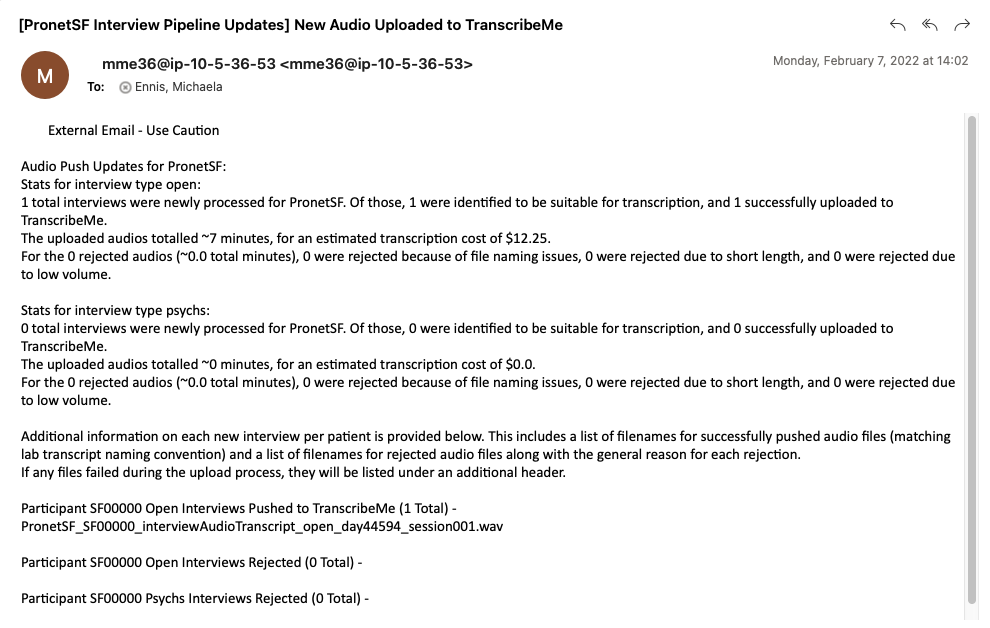
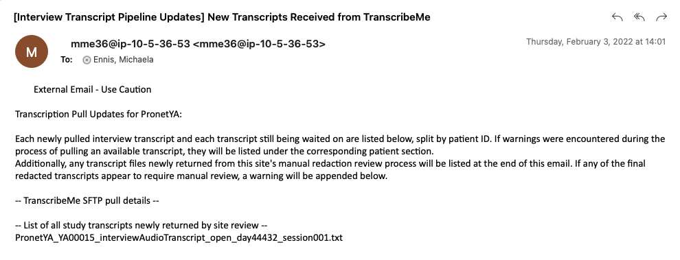
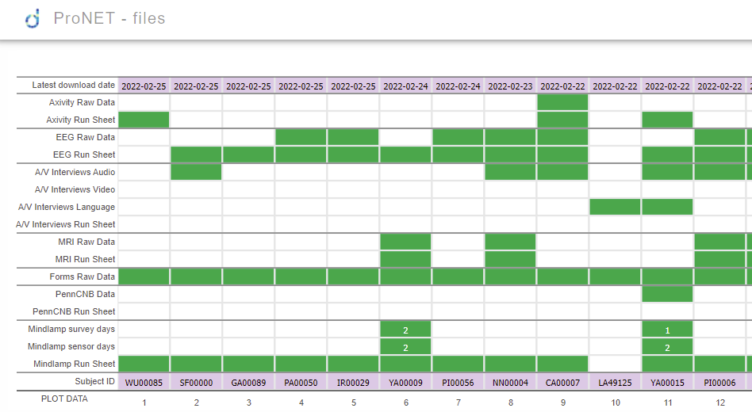
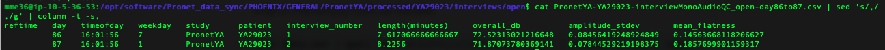
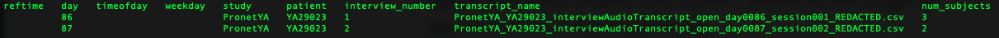
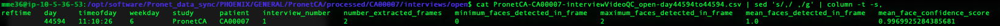

# U24 Interview AV Data Aggregation and Quality Control
Code for data organization and quality control of clinical interview audio and video recorded from Zoom, currently focused on minimum necessary steps for initial use by U24 sites. This repository is a prerelease of Baker Lab code, made publicly viewable for the purposes of testing on collaborator machines. Contact mennis@g.harvard.edu with any unanswered questions.

The audio side of the pipeline converts/renames any new mono interview audio files and extracts QC measures from these files. It then handles automatic upload of acceptable audio to TranscribeMe, along with emailing documentation to the group. It does not currently process speaker-specific audio files.  

The transcript side of the pipeline analogously handles pulling returned transcripts back to the server, integrating with the existing dataflow for sites to review redaction quality and share anonymized data with the larger study. It also includes email updates and computation of quality control metrics on the returned transcripts, for monitoring of the entire data collection process. 

The video portion of the pipeline identifies unprocessed video files in valid Zoom interview folders and extracts one frame from every 5 minutes of each video. These frames are then run through a lightweight face detection model from PyFeat, to provide some video quality control at low computational cost. The same script also gets metadata information about the interview (e.g. converting to study day number) in order to fill out a DPDash-formatted QC CSV analogous to those created for audio and transcripts. 

### Table of Contents
1. [Setup](#setup)
	- [Input Data Requirements](#inputs)
2. [Use](#use)
	- [Architecture Diagram](#diagram)
	- [Common Issues](#issues)
3. [Audio Processing Details](#audio)
	- [Security](#security)
4. [Transcript Processing Details](#transcript)
	- [TranscribeMe Conventions](#transcribeme)
5. [Video Processing Details](#video)
6. [Examples Outputs](#outputs)
	- [Emails](#email)
	- [DPDash CSVs](#dpdash)
7. [Status](#status)
	- [Pronet](#pronet)
	- [Prescient](#prescient)
8. [Next Steps](#todo)
	- [Code](#code)
	- [Logistics](#logistics)

### Setup 
The code requires ffmpeg and python3 to be installed, as well as use of standard bash commands. For the email alerting to work, the sendmail command must be configured. The python package dependencies can be found in the setup/audio_process.yml file, with the exception of soundfile and librosa on the audio side and pyfeat on the video side. If Anaconda3 is installed this file can be used directly to generate a usable python environment. 

	
For initial setup on the Pronet development server, the following steps were taken:

First, I installed Anaconda -
* wget https://repo.anaconda.com/archive/Anaconda3-5.3.1-Linux-x86_64.sh
* bash Anaconda3-5.3.1-Linux-x86_64.sh 
	* (Answered yes to bashrc question, no to Visual Studio question, other prompts kept as default by just pressing enter)
* rm Anaconda3-5.3.1-Linux-x86_64.sh
* source .bashrc

Note ffmpeg, the other main dependency, was already working on the machine. The sendmail command has also now been installed/configured by support.  

Then I setup the repository with included Anaconda environment -
* cd /opt/software
* git clone https://github.com/dptools/process_offsite_audio.git 
* cd process_offsite_audio/setup
* conda env create -f audio_process.yml
* conda activate audio_process
* pip install soundfile
* pip install librosa
* cd ..

Because of the way that TranscribeMe passwords are stored, the audio and transcript code should generally be run by the same account that completes this installation.

When the video code was added, I also added PyFeat to the environment. However the development machine was unable to install PyFeat directly due to resource limitations, so a few PyFeat dependencies were installed separately first. The full list of steps I took were - 
* conda activate audio_process
* pip install opencv-python
* pip install torch --no-cache-dir
* pip install py-feat

##### Input Data Requirements 

The pipeline expects to work within a PHOENIX data structure matching the conventions described in the U24 SOP. 

	
The basic input assumptions are as follows:

The audio side looks for interviews/psychs and interviews/open datatypes on the PROTECTED side of raw, which should be (exclusively) populated by Lochness. Any data under these folders is expected to match one of two conventions - either a folder produced by Zoom uploaded as is or a standalone audio file recorded using a single physical device named according to the convention YYYYMMDDHHMMSS.WAV. For the Zoom interviews, the code currently only processes the single combined audio file provided. 

The transcript side of the pipeline primarily relies on outputs from the audio side. It also expects a box_transfer/transcripts folder on the top level of the PHOENIX structure's PROTECTED side, to facilitate transfering completed transcripts to the corresponding sites for correctness review. In finalizing the transcripts that are subsequently returned by sites, it looks for interviews/transcripts datatype on the PROTECTED side of raw. 

The code also requires a metadata file under the study level of GENERAL, and will only process a particular patient ID if that ID appears as a row in the metadata file containing a valid consent date (per Lochness guidelines). If there are issues encountered with the basic study setup appropriate error messages will be logged.

Note the pipeline only ever reads from raw datatypes. All pipeline outputs are saved/modified as processed datatypes. The deidentified data that make it under the GENERAL side of processed will subsequently be pushed by Lochness to the NDA data lake.

[For more information, the Data Transfer SOP can be found here.](https://docs.google.com/document/d/1sVHIB313CLfmGuy6Sbk28kElw7pqp0wYjF_dEFCiY4g/edit#heading=h.6j7n1rfryn4k)

### Use 
The pipeline will generally be run using the three wrapping bash scripts provided in the top level of this repository, with the path to a settings file as the single argument. The audio_process conda environment should be activated prior to launching these scripts. For an example of how to put together a settings file for a particular study, see example_config.sh. The full audio side pipeline can then be run by using:

	bash interview_audio_process.sh example_config.sh

The transcript side of the pipeline can be run using the same settings file with:

	bash interview_transcript_process.sh example_config.sh

Finally, the video side of the pipeline can again be run using the same settings file with:

	bash interview_video_process.sh example_config.sh

For use on Pronet, config files are already generated for each site in the Pronet_site_configs subfolder, and can be edited as needed. The all_sites_cron_script.sh runs the audio, transcript, and video sides of the pipeline for each of these configs, used for running the code across sites (currently on the Pronet dev server at 2pm daily).

##### Architecture Diagram 
Each major step is initiated by the pipeline using a script in the individual_modules folder, see this folder if specific steps need to be run independently. 

	
Click here for an overview of data flow and the use of different modules through the pipeline

 

Additional details on each step are provided below. 

##### Common Issues 
Most times that an interview is not processed when expected there is an issue with violating naming conventions, either because the data was incorrectly placed so Lochness could not pull it, or the files within the Zoom folder were renamed so that this audio code could not recognize it. It has also been common during the testing phase for subject IDs to be missing metadata - if there is a new subject ID it needs to be entered in REDCap before the code can process.

Outside of users not following the SOP, there are a few likely avenues for possible bugs that should be monitored:
* Folder permissions issues or low storage availability on the data aggregation server
* TranscribeMe typos or otherwise inconsistencies in provided transcripts - could also be unanticipated problems with foreign languages
* Stopping and starting of recording in the same Zoom interview, whether intentionally or due to host disconnects

If a code issue needs to be investigated, log files are automatically saved under a subfolder of the repository install, organized by site and labeled with pipeine name and Unix run time. 

### Audio Processing Details 
The major steps of the audio side of the pipeline are:
1. Identify new audio files in raw by checking against existing QC outputs
2. Convert any new audio files in raw to WAV format if not already, saving WAV copies of all new audio files on the processed side of PROTECTED
3. Rename the new audio file copies to match SOP convention
4. Run audio QC on the new audio files
5. Check for sufficient volume levels and acceptable interview lengths
6. Upload all approved new audio files to TranscribeMe (with temporarily added site-based language marker, to assist TranscribeMe in assigning transcribers)
7. Send email listing all files that were newly processed, indicating which were successfully uploaded to TranscribeMe and otherwise documenting possible issues

	
Aside from the renamed and converted audio files that can be used directly for future processing by U24 code, the primary immediate outputs of this code are the audio QC features:

 
The main audio QC output CSV provides one row per interview with the following summary stats -
* Metadata for DPDash formatting
* Length of audio (in minutes)
* Overall volume (in dB)
* Standard deviation of amplitude (related to variance of volume)
* Mean of spectral flatness computed by librosa

One such CSV will be generated per subject ID, separately for the open and psychs interview types. These CSVs are saved on the GENERAL side of processed, and thus will be included in the data aggregation for sharing. They are intended to be used with the DPDash interface for study monitoring.

The audio QC processing also includes a sliding window QC operation, which computes decibel level and mean flatness in each designated bin (3 second sliding window with no overlap), creating one output file per interview audio. These outputs can be used for further processing but are kept on the PROTECTED side and so not currently shared with the wider group. They are used by the pipeline to check processing status among the raw audios.

##### Security 

	
For security review, the audio files are pushed to TranscribeMe using the following process:

We connect to the TranscribeMe server via SFTP. The pySFTP python package, a wrapper around the Paramiko package specific for SFTP is used to automate this process. The host is sftp.transcribeme.com. The standard port 22 is used. The username is provided as a setting to the code, but will generally be one account for all sites on the Pronet side and one account for all sites on the Prescient side, with set up of this facilitated by TranscribeMe. These accounts are created only to be used with this code and will serve no other purpose.

The account password is input using a temporary environment variable. It was previously prompted for using read -s upon each run of the code, but for the purposes of automatic scheduled jobs, the password may now be stored in a hidden file with restricted permissions on a PROTECTED portion of our machine instead. Anyone who could access this file necessarily must also have access to the raw files themselves, so use of the TranscribeMe password would provide no additional benefit. 

Note that once the transcript side of the pipeline has detected a returned transcript on this SFTP server, the corresponding uploaded audio is deleted by our code on TranscribeMe's end using the same SFTP package. 

If additional details are needed, please reach out. We can also put you in touch with the appropriate person at TranscribeMe to document security precautions on their end.

### Transcript Processing Details 
The major steps of the transcript side of the pipeline are:
1. Check the TranscribeMe server for any pending transcriptions
2. For transcripts that are newly available, pull them back onto our server and delete the corresponding audio from TranscribeMe's server
3. Copy any transcripts marked for manual screening by the sites into the necessary folder for push to Box/Mediaflux
4. Copy any transcripts that have been newly returned by the sites after review into the final PROTECTED transcripts folder
5. Create redacted versions of any newly finalized transcripts under the GENERAL side
6. Convert the newly redacted transcripts to CSV format
7. Compute transcript QC stats across the redacted transcripts
8. Send email listing all the transcripts that were successfully pulled from TranscribeMe and those still awaiting transcription, as well as the transcripts newly returned from manual review by sites 

Note that the Box/Mediaflux push described in step 3 is done by separate code written by the Pronet/Prescient teams respectively (latter remains to be implemented). The return of reviewed transcripts is handled by Lochness. Sites will go through any transcripts sent to them, mark any PII missed by TranscribeMe with curly braces (per TranscribeMe convention), and move to a folder indicating completed review (which Lochness can then pull from). Currently the code sends all transcripts for review by sites, but per the U24 SOP the code will eventually be updated to send a random subset only for review. Anything not sent for review will inmediatly undergo steps 5 and on. 

	
The primary outputs of this side of the pipeline include the transcripts at various stages of processing, as well as the final derived QC measures, as detailed here:

All transcripts that contain PII are kept on the PROTECTED side, and thus will not be shared with the wider group. Transcripts that have passed over or completed the manual site review are kept in main transcripts folder of processed. For those transcripts that are sent for site review, a copy as it was returned by TranscribeMe can be found in a prescreening subfolder, so if changes are made by sites it will remain possible to refer back to the original transcript if necessary. 

Because PII is enclosed by curly braces as part of the transcription protocol, it is straightforward to generate a version of each transcript where the PII is actually removed (each such word replaced by REDACTED). This version is put on the GENERAL side of processed for syncing to the data lake. Also included is the CSV version of the transcript for easier processing by automated methods, where each row is a line of the transcript containing speaker ID, timestamp, and text as the main columns.

Using these CSVs, the following transcript QC metrics are computed - 
* Metadata for DPDash formatting
* Number of unique speaker IDs used by TranscribeMe
* For each of the first three speaker IDs (S1-S3), the following counting stats
	* Total number of sentences
	* Total number of words
	* Smallest number of words in a sentence
	* Largest number of words in a sentence
* Number of times the audio was marked inaudible
* Number of times a transcript portion was marked as uncertain
* Number of times crosstalk was marked
* Number of words redacted
* Total number of commas appearing (related to disfluency markers)
* Total number of dashes appearing (related to disfluency markers)
* Timestamp for the start of the final sentence, in minutes
* Shortest gap between the starts of two subsequent sentences, in seconds
* Longest gap between the starts of two subsequent sentences, in seconds
* The shortest and longest gaps weighted by the number of words in the intervening sentence

One such CSV will be generated per subject ID, separately for the open and psychs interview types. These CSVs are saved on the GENERAL side of processed, and thus will be included in the data aggregation for sharing. They are intended to be used with the DPDash interface for study monitoring.

Interfacing with TranscribeMe is done using the same SFTP protocol as described in the audio section. 

##### TranscribeMe Conventions 
We receive full verbatim transcriptions from TranscribeMe, with sentence level timestamps and speaker identification included. As mentioned above, any PII in the transcription is marked by curly braces. 

[To properly interpret the full verbatim transcriptions, please see TranscribeMe's (English) style guide here.](https://www.dropbox.com/s/lo19xzux3n16pbn/TranscribeMeFullVerbatimStyleGuide.pdf?dl=0)

### Video Processing Details 
The major steps of the video side of the pipeline are:
1. Identify new video files in raw by checking against existing extracted frames
2. Extract 1 frame from every 5 minutes of any new raw video file, saving images in an interview-specific subfolder on the processed side of PROTECTED
3. Run PyFeat's basic face detection model, saving a corresponding CSV for each image
4. Use PyFeat outputs from across each interview along with study/interview metadata information to update DPDash-formatted video QC CSV on the processed side of GENERAL

	
The primary output of this side of the pipeline is the DPDash CSV, although the extracted images and their corresponding PyFeat outputs could also be useful. The details of these outputs are as follows:

Because the DPDash CSV is saved on the processed side of GENERAL, it is pushed to the data lake. It is of course intended to be imported into DPDash for further monitoring. As per convention there is one CSV generated per subject ID and interview type, containing one row per interview. Besides the DPDash metadata columns, the QC columns include - 
* Number of frames extracted (will be the floor of interview minutes divided by 5)
* Minimum number of faces detected in an extracted frame
* Maximum number of faces detected in an extracted frame
* Average number of faces detected across extracted frames
* Minimum confidence score across faces that were detected
* Maximum confidence score across faces that were detected
* Average confidence score across faces that were detected
* Minimum area across faces that were detected (area computed by multiplying the height and width variables returned by PyFeat)
* Maximum area across faces that were detected
* Average area across faces that were detected

On the processed side of PROTECTED, the extracted frames will remain so that more robust QC could be done if compute resources on another machine allow (it is not possible to load the standard face pose or action unit detection models on the Pronet development server at this time). The CSVs saved per image could also be of use for expanding what we provide in the final QC spreadsheet. These CSVs contain one row per detected face, with the follow features provided - 
* Face location X coordinate 
* Face location Y coordinate
* Face rectangle width
* Face rectangle height
* Detection confidence score

### Example Outputs 
As discussed above, there are a few different types of outputs generated by this code:
* Intermediate outputs that may be used for additional future processing steps, stored under PROTECTED/processed
* Final outputs that are stored under GENERAL/processed and subsequently pushed by Lochness to the data lake
* Communication, which includes email alerts for monitoring code status and interfaces on DPDash for checking data quality

In this section, examples of the most user-relevant outputs are provided from some of our mock interview test data, focusing on the "communication" category.

##### Emails 
These are the primary mode of communication for the pipeline. For each site a set of email addresses can be provided in the config file, and then site-specific updates on new interviews will be sent to the specified addresses upon each daily run of the code. The audio email is only sent if new audio files are processed for that site, and the transcript email is only sent if that site has newly processed transcripts (returned from TranscribeMe or from site review) or is actively awaiting transcripts from TranscribeMe. 

	
Click here for an example of an audio update email

 

	
Click here for an example of a transcript update email from a new upload to TranscribeMe

 

	
Click here for an example of a transcript update email from a transcript newly returned from manual site redaction review

 

The emails continue to be refined and their exact content may change.

##### DPDash CSVs 
These are the primary outputs pushed to the data lake (besides the redacted transcripts), and also will be used for data quality monitoring once appropriate DPDash configurations are created. Audio, transcript, and video QC DPDash-formatted CSVs are generated for each subject ID and interview type with existing data. The DPACC team has also added tracking of these files into their data accounting script. 

	
Click here for an example snippet of the Pronet file accounting page on DPDash, now including rows that indicate availability of audio, transcript, and video QC outputs for each subject ID

 

	
Click here for an example of an audio QC CSV

 

	
Click here for an example snippet of a transcript QC CSV, chosen because it detected a typo in the speaker identification in one of the transcripts (one line was attributed to S21). Note many additional transcript QC features were omitted from this image for legibility

 

	
Click here for an example snippet of a video QC CSV. In this example there are no faces detected at the start of the video, but 2 faces as expected at the 5 minute mark (it is a short interview). Note some additional video QC features were omitted from this image

 

For more information on the specific features extracted as part of each of the above QC modules, see the associated "Processing Details" section above.

### Current Status 
Test data collection has begun across sites, awaiting real data collection. The primary aim for the code right now is therefore to robustly test it on the mock interviews that are provided by sites and pulled to the development data aggregation server by Lochness. 

##### Pronet 
This code has been running autonomously on the Pronet development server since early February 2022. Only a minority of sites have correctly added properly formatted interviews to Box and registered the corresponding subject ID in REDCap, but the code has worked well in those cases.

	
Details on site mock interview status as of 3/9/2022:

Sites that have successfully had some data processed - 
* PronetLA, PronetYA, and PronetNN have had an interview make it all the way through the pipeline.
	* In the case of PronetYA 3 interviews have gone through, all other sites with any processing have done a single interview.
* PronetCA, PronetSF, PronetPI, PronetOR, PronetSI, and PronetGA have had transcripts returned by TranscribeMe, but have not yet correctly completed the manual redaction review process.
	* PronetOR has put the reviewed transcript in the wrong spot on Box, the others don't seem to have done any review at all.

As mentioned there are other sites that have tried to put interviews in Box but there were issues that prevented them from being processed. Multiple interviews are unable to be pulled by Lochness - Kevin's email summary can be referred to for more information on these cases. There have also been cases of interviews pulled by Lochness but with naming issues that prevented the audio code from recognizing them. PronetNC is the only such active case I am aware of.

All sites should have a test interview complete processing, in order to ensure that everyone understands the data collection procedures and has functioning equipment. There are also a few things in particular that really should still be tested - 
* There has not yet been a non-English test audio uploaded.
	* Testing is especially needed for languages with a very different character set than English.
* No sites have uploaded a test interview under the “psychs” category.
	* These are processed independently from “open” interviews, although the steps are basically the same.
	* The one concern about “psychs” is it can also sometimes involve upload of a single file from an external audio recording device instead of a Zoom interview. The code is written to address this but requires closer testing.

An initial install has been done on the Pronet production server, but details and testing there remain to be ironed out. 

##### Prescient 
We have not yet done any testing of this code on Prescient, but are in the process of finding a time for a meeting with all relevant parties to get things going. The majority of the code should directly translate from Pronet to Prescient. Potential issues to address are noted under Next Steps below. 

### Next Steps 
The next steps described here focus on what is necessary to finalize the data flow and quality control workflow for production data collection across sites. Once dataflow and quality control are successfully running, we will then come up with a plan for writing more intensive feature extraction code for the interview datatypes. The feature extraction code will be kept in a separate repository so that it can easily be installed on a separate production machine.

##### Code 

	
The file accounting portions of the code still need to be expanded upon:

* Maintain a CSV mapping Zoom folder names to renamed audio file names under PROTECTED, so that deletion of WAV files is an option if storage becomes a problem
	* Could something similar be done for the extracted images on the video side as well?
* Add some basic tracking of the existence of speaker-specific audio files
	* Count of different speakers (by Zoom display name)
	* Number of files per speaker (can be split if participant exits and then reenters the Zoom room)
* For the psychs interview type, should make a note of whether interviews are standalone WAV files or full Zoom interviews, so that we know whether other files (video, speaker specific audio) should be expected
* Make sure any naming conventions we do enforce are consistent between the video and audio pipelines

	
There are also multiple updates to make to the email alert system:

* Make necessary tweaks to the existing audio and transcript emails
	* Ensure audio email alert will still send in the case where new audio is processed but none is uploaded to TranscribeMe
	* Detect when audio side code has crashed, preventing full email summary from being generated - that way this case can be handled separately with appropriate notifications sent
	* Review "from" field of emails, particularly where trying to add a reply-to address
* Implement a site-specific email for when file naming issues are detected on the raw side of PHOENIX
	* The email alerts sent by Lochness focus on problems in the source folders, but there are also possible situations where an interview is able to be pulled by Lochness but then can't be processed by this code due to naming issues
	* The logs already note when naming conventions are violated, so would just need to compile this into an email as well
	* The email should probably add a note about consulting with IT to get the bad interview off the server side, because otherwise even once it is fixed by the site the notification will persist due to Lochness not removing files that were deleted on the source
* Add a summary email that compiles complete status to date from across sites
	* Compile a table of raw interviews to basic info about them for each participant and interview type
	* Can include relevant file names, date the raw file was pulled to PHOENIX, date the transcript was returned from TranscribeMe, info on manual site review where needed, and any problems that occured with the interview
	* The script that runs the pipeline across sites that is currently on a cron can then be updated to concatenate all of these tables from all of the sites
	* That will then be emailed to those that are supervising the U24 at a higher level (how to format the table using just basic mailx command?)
	* Need to be careful of PII in these emails? It should be okay to include the dates as long as we are careful about who receives the emails. But keep in mind display names are in the speaker specific Zoom files, that could be much more sensitive (this also applies to the Lochness email alerts!)
	* Will want to consider how this email alert (and others from this pipeline) will integrate with what Lochness is already doing on both the pull and push sides. 

	
Finally, there are a few features that remain to be added:

* Implement the transcript manual review as a random selection of 10% of transcripts per site instead of sending all transcripts for additional review
	* This phase will occur once a given site has had 5 transcripts reviewed - so need to keep the current code as well, have an appropriate toggle
	* Can use the "completed" folder under box_transfers to track how many transcripts have already been pushed for review to the sites
	* For the actual random selection, should be fine to just use a random number generator to get a 10% chance independently for each file
	* Once it is implemented, also need to make sure that the status emails and other file accounting pieces of the pipeline are updated to appropriately reflect
* Add preprocessing for Teams and WebEx interviews to accommodate the couple of Prescient sites that cannot use Zoom
	* Waiting on examples of interviews from these softwares first
* Improve how code processes non-English transcripts
	* Switch check for required encoding to UTF-8 instead of ASCII
	* Update transcript QC code so features are correct in every language (requires some more information from TranscribeMe in part)
	* Should also make sure that Zoom file naming conventions are not substantially different in different countries!

Once the above TODOs are done, a full code review should be performed to ensure everything is well documented and no unnecessary pieces of old code remain. Could also make note of possible future efficiency improvements at that time.

##### Logistics 
For the existing protocols, it is an ongoing issue to ensure that sites are aware of and following all the expectations. 

	
There are also some details that need to be verified on our end still in order to make some final decisions about the code:

* How long are the interview videos generally expected to be? We may want to adjust how frequently frames are extracted from the videos for the QC
* How will we identify from the speaker specific audio file names which audio belongs to the participant? Interviewers could keep a consistent display name or sites could provide a list of all interviewer display names used perhaps. Regardless, this will be another issue for file accounting code to check once a method is decided on
* The transcript timestamps are currently only second level resolution, which may present issues. TranscribeMe could also provide millisecond level, which may not be accurate down to the millisecond but is at least reliable on the hundred millisecond level - and that could make a big difference for interview periods with shorter sentences
* How do we want to identify which TranscribeMe speaker ID is the participant? Should we have some convention like always having the interviewer say some particular word at the start, or can we tackle the problem with purely automated methods? Or perhaps the transcriber could intentionally use a particular ID for who they think the participant is?
* TranscribeMe has sometimes been inconsistent with the exact characters that they use for dashes and other things important to represent in the verbatim style transcriptions. We will need to contact them about this and keep an eye out
* Also still waiting on TranscribeMe to answer about the verbatim transcription conventions in other languages. Need to confirm what will be different (at the very least I would expect markings like "inaudible" to be different)

	
Before we can launch, many questions still remain about code monitoring and communication with various relevant parties as well. The main TODOs there are:

* Make decisions about email usage
	* Does content of any of the emails need to be further updated?
	* Who should receive which emails? 
	* How often should emails go out?
	* Any PII concerns with the emails to address?
* Make decisions about code monitoring
	* What account is going to run the code?
	* Ensure file permissions generated by Lochness are compatible, particularly for the processed folders under both PROTECTED and GENERAL
	* What should file permissions be of various code outputs?
	* How often should the code run?
	* Who will handle it when changes need to be made on the server? Could involve changes to code, changes to files in processed folders, or changes to files in raw folders
	* Who will be checking the QC outputs on DPDash?
* Finish actually setting up DPDash
	* Make sure audio, transcript, and video CSVs are being imported
	* Decide which features we want to display from each
	* Create config files on the UI and ensure colormap bounds make sense for each feature shown
* Set protocol for communication with sites
	* What happens when sites have mistakes with file naming/organization conventions?
	* What happens when sites are missing data or don't complete a necessary manual review?
	* What happens when sites upload poor quality data?
	* Who will be in charge of all of this?
* Set protocol for communication with TranscribeMe
	* On both sides, who will be receiving any automated communication about SFTP uploads?
	* What happens when TranscribeMe does not upload a transcript we are expecting for an extended period?
	* What happens when a transcript has enough issues that it needs to be redone?
	* What happens when there is a minor issue in a transcript (outside of the already defined site redaction review)?
	* Will we be providing TranscribeMe with continual feedback?
	* Who will be in charge of all of this?
	* What if an issue arises that requires a speaker of a non-English language?
* Will these communication protocols need to differ between the Pronet and Prescient networks?

	
Finally, there are a few logistics to handle specific to Pronet and Prescient. For Pronet, we just need to take the last steps for setup of the production server. This involves confirming that the latest version of the code with the new video QC features is installed, verifying that this code passed the Yale IT security review, and performing an actual test run on prod. For Prescient, there are many more steps, as we still need to get the development server installation working first before proceeding to production setup. The major blockers we are actively trying to address for this are:

* Completing code security review, as we require approval to install the code even on the dev server
* Figure out how the code will integrate with MediaFlux instead of Box
* Get a TranscribeMe SFTP account
* Compile a table of the languages that will be used at the different sites 

